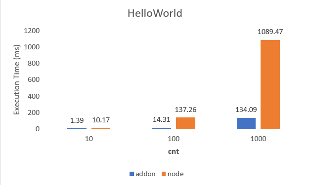

### How to build it?

**pre-build**

1. `npm install -g windows-build-tools` in admin mode.

**build**

1. `npm install`
2. `npm run build`
3. `npm run start`

---

### Hello, World!

**Addon :**

```cpp
// Addon
void helloWorld(int64_t cnt){
    for(int64_t i=0; i<cnt; i++){
        printf("Hello, World!\n");
    }
}
```

**Node :**

```ts
// Node
function helloWorld(cnt: number) {
    for (let i = 0; i < cnt; i++) {
        console.log("Hello, World!");
    }
}
```

---

### Benchmark


