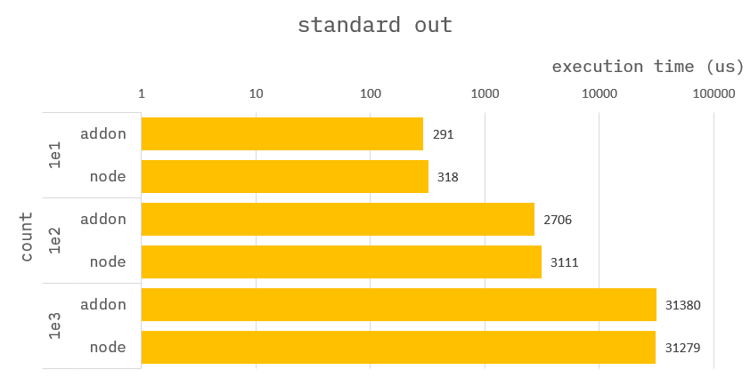
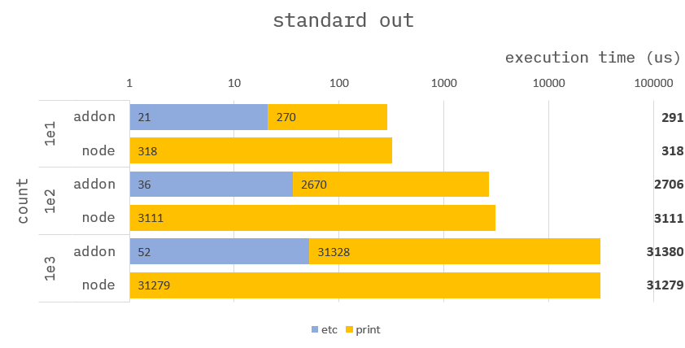

### How to build it?

**pre-build**

1. `npm install -g windows-build-tools` in admin mode.

**build**

1. `npm install`
2. `npm run build`
3. `npm run start`

---

### Print `Hello, World!`


**Addon :**

```cpp
Napi::Object standardOut(const Napi::CallbackInfo& info)
{
    std::vector<std::chrono::steady_clock::time_point> time;

    /* ------------------------------------
     *  Section : read data.
     * ------------------------------------ */
    time.push_back(std::chrono::high_resolution_clock::now());
    //
    // get argument.
    auto env = info.Env();
    auto obj = info[0].As<Napi::Object>();
    auto cnt = obj.Get("cnt").ToNumber().Int64Value();
    auto str = obj.Get("str").ToString().Utf8Value();
    time.push_back(std::chrono::high_resolution_clock::now());

    /* ------------------------------------
     *  Section : calc sum of array.
     * ------------------------------------ */
    time.push_back(std::chrono::high_resolution_clock::now());
    for (uint32_t i = 0; i < cnt; i++) {
        printf("%s\r", str.c_str());
    }
    time.push_back(std::chrono::high_resolution_clock::now());

    //
    // Assign result to ans.
    auto ans = Napi::Object::New(env);
    auto statics = Napi::Object::New(env);
    ans["ans"] = env.Null();
    ans["statics"] = statics;
    statics["print"] = std::chrono::duration_cast<std::chrono::nanoseconds>(time[3] - time[2]).count();
    statics["read"] = std::chrono::duration_cast<std::chrono::nanoseconds>(time[1] - time[0]).count();
    return ans;
}
```

**Node :**

```ts
function standardOut({ cnt, str }) {
    for (let i = 0; i < cnt; i++) {
        process.stdout.write(`${str}\r`);
    }
    return {
        ans: null,
        statics: {}
    };
}
```

---

### Benchmark



---

### Benchmark-Detail



#### Conclusion :

There is no significant difference in performance.
