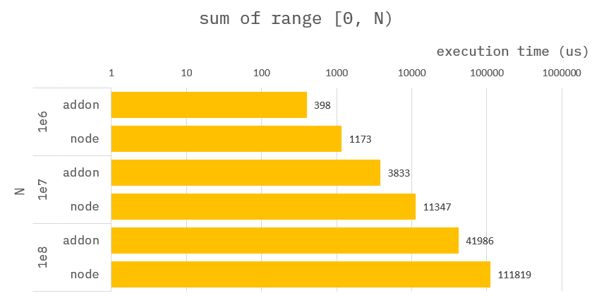
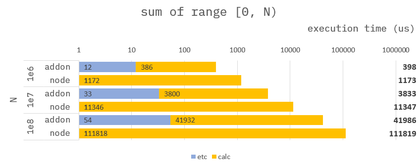

### How to build it?

**pre-build**

1. `npm install -g windows-build-tools` in admin mode.

**build**

1. `npm install`
2. `npm run build`
3. `npm run start`

---

### Calc sum of range [0, N)


**Addon :**

```cpp
Napi::Object getSumOfRange(const Napi::CallbackInfo& info)
{
    std::vector<std::chrono::steady_clock::time_point> time;

    /* ------------------------------------
     *  Section : read data.
     * ------------------------------------ */
    time.push_back(std::chrono::high_resolution_clock::now());
    //
    // get argument.
    auto env = info.Env();
    auto obj = info[0].As<Napi::Object>();
    auto end = obj.Get("end").As<Napi::Number>().Int64Value();
    time.push_back(std::chrono::high_resolution_clock::now());

    /* ------------------------------------
     *  Section : calc sum of array.
     * ------------------------------------ */
    time.push_back(std::chrono::high_resolution_clock::now());
    int64_t sumOfRange = 0;
    for (uint32_t i = 0; i < end; i++) {
        sumOfRange += i;
    }
    time.push_back(std::chrono::high_resolution_clock::now());

    //
    // Assign result to ans.
    auto ans = Napi::Object::New(env);
    auto statics = Napi::Object::New(env);
    ans["ans"] = Napi::Number::New(env, sumOfRange);
    ans["statics"] = statics;
    statics["calc"] = std::chrono::duration_cast<std::chrono::nanoseconds>(time[3] - time[2]).count();
    statics["read"] = std::chrono::duration_cast<std::chrono::nanoseconds>(time[1] - time[0]).count();
    return ans;
}
```

**Node :**

```ts
function getSumOfRange({ end }) {
    let sumOfRange = 0;
    for (let i = 0; i < end; i++) {
        sumOfRange += i;
    }
    return {
        ans: sumOfRange,
        statics: {}
    };
}
```

---

### Benchmark



---

### Benchmark-Detail


