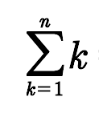
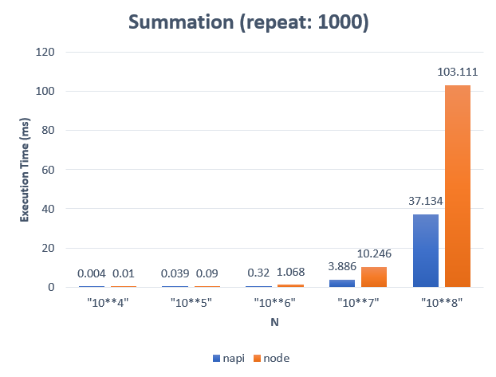

### How to build it?

**pre-build**

1. `npm install -g windows-build-tools` in admin mode.

**build**

1. `npm install`
2. `npm run build`
3. `npm run start`

---

### Summation



**Addon :**

```cpp
int64_t summation(int64_t n){
    int64_t sum = 0;
    for(int64_t i=0; i <= n; i++){
        sum += i;
    }
    return sum;
}
```

**Addon implemation :**

```cpp
Napi::Number summation(const Napi::CallbackInfo& info)
{
    //
    // Get first argument as int64_t.
    int64_t n = info[0].As<Napi::Number>().Int64Value();

    //
    // Calc summation.
    int64_t sum = 0;
    for (int64_t i = 0; i <= n; i++) {
        sum += i;
    }

    //
    // Return as Number.
    Napi::Env env = info.Env();
    return Napi::Number::New(env, sum);
}
```

**Node :**

```ts
function summation(n: number) {
    let sum = 0;
    for (let i = 0; i <= n; i++) {
        sum += i;
    }
    return sum;
}
```

---

### Benchmark


