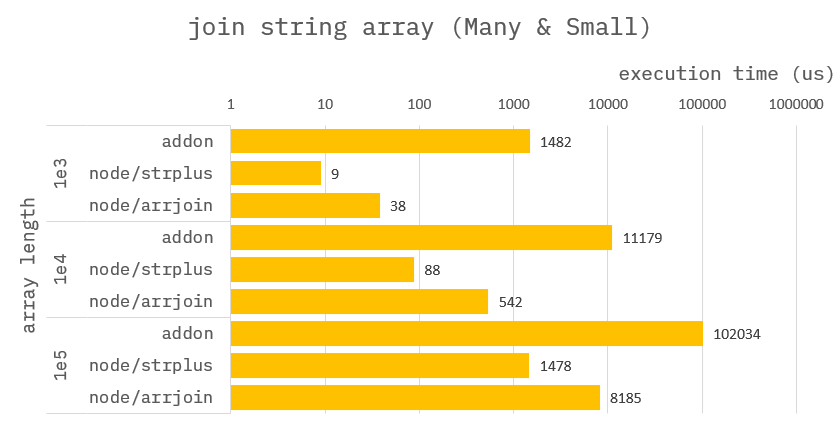
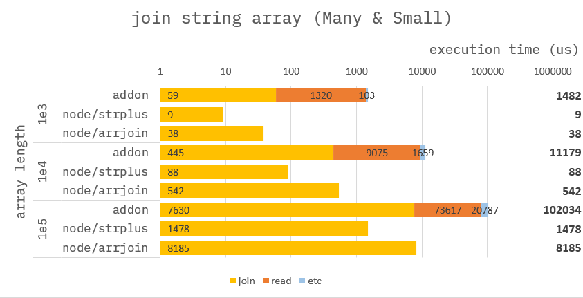
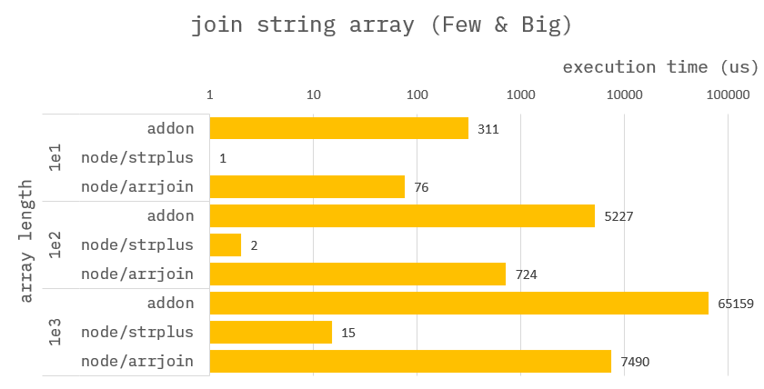
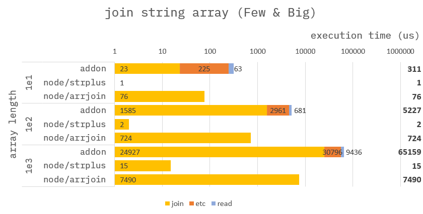

### How to build it?

**pre-build**

1. `npm install -g windows-build-tools` in admin mode.

**build**

1. `npm install`
2. `npm run build`
3. `npm run start`

---

### Join string array


**Addon :**

```cpp
Napi::Object joinStringArray(const Napi::CallbackInfo& info)
{
    std::vector<std::chrono::steady_clock::time_point> time;

    /* ------------------------------------
     *  Section : read data.
     * ------------------------------------ */
    time.push_back(std::chrono::high_resolution_clock::now());
    //
    // get argument.
    auto env = info.Env();
    auto obj = info[0].As<Napi::Object>();
    auto strarr = obj.Get("strarr").As<Napi::Array>();

    //
    // assign argument to vector.
    uint32_t arrlen = strarr.Length();
    std::vector<std::string> vec;
    vec.reserve(arrlen);
    for (uint32_t i = 0; i < arrlen; i++) {
        std::string str = strarr.Get(i).As<Napi::String>().Utf8Value();
        vec.push_back(str);
    }
    time.push_back(std::chrono::high_resolution_clock::now());

    /* ------------------------------------
     *  Section : calc sum of array.
     * ------------------------------------ */
    time.push_back(std::chrono::high_resolution_clock::now());
    std::string joined = "";
    for (uint32_t i = 0; i < arrlen; i++) {
        joined += vec[i];
    }
    time.push_back(std::chrono::high_resolution_clock::now());

    //
    // Assign result to ans.
    auto ans = Napi::Object::New(env);
    auto statics = Napi::Object::New(env);
    ans["ans"] = Napi::String::New(env, joined);
    ans["statics"] = statics;
    statics["join"] = std::chrono::duration_cast<std::chrono::nanoseconds>(time[3] - time[2]).count();
    statics["read"] = std::chrono::duration_cast<std::chrono::nanoseconds>(time[1] - time[0]).count();
    return ans;
}
```

**Node :**

```ts
//
// node/strplus
function joinStringArrayByStrPlus({ strarr }) {
    let joined = "";
    for (let i = 0; i < strarr.length; i++) {
        joined += strarr[i];
    }
    return {
        ans: joined,
        statics: {}
    };
}
```

```ts
//
// node/arrjoin
function joinStringArrayByArrJoin({ strarr }) {
    return {
        ans: strarr.join(),
        statics: {}
    };
}
```

---

### Benchmark

> Measure the average of 10,000 times.

> When each word is **short** _(1 <= length <= 100)_, but **numerous**.



---

### Benchmark-Detail

> Measure the average of 10,000 times.

> When each word is **short** _(1 <= length <= 100)_, but **numerous**.



---

### Benchmark

> Measure the average of 10,000 times.

> When each word is **long** _(100,000 <= length <= 200,000)_, but **small in number**.



---

### Benchmark-Detail

> Measure the average of 10,000 times.

> When each word is **long** _(100,000 <= length <= 200,000)_, but **small in number**.


