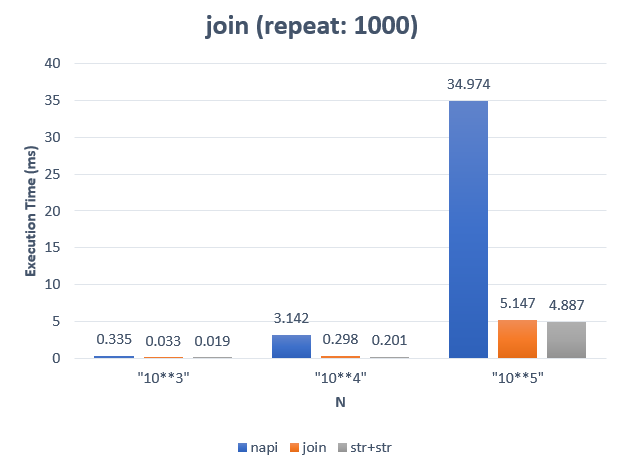
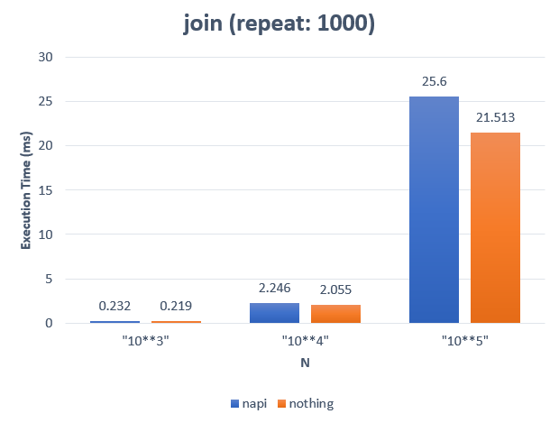

### How to build it?

**pre-build**

1. `npm install -g windows-build-tools` in admin mode.

**build**

1. `npm install`
2. `npm run build`
3. `npm run start`

---

### String Array Join


**Addon :**

```cpp
string join(vector<string> arr, string separator){
    string joined;
    size_t arrlen = arr.size();
    for(size_t i=0; i<arrlen; i++){
        joined.append(arr[i]);
        joined.append(separator);
    }
    return joined;
}
```

**Addon implemation :**

```cpp
Napi::String join(const Napi::CallbackInfo& info)
{
    Napi::Env env = info.Env();

    //
    // Get first argument as Array.
    Napi::Array arr = info[0].As<Napi::Array>();

    //
    // Get second argument as string.
    std::string separator = info[1].ToString().Utf8Value();

    //
    // Append to string-stream.
    std::string joined;
    uint32_t arrlen = arr.Length();
    for (uint32_t i = 0; i < arrlen; i++) {
        std::string str = strarr.Get(i).As<Napi::String>().Utf8Value();
        joined.append(str);
        joined.append(separator);
    }

    //
    // Return as String.
    return Napi::String::New(env, ss.str());
}
```

**Node using array.join() :**

```ts
function join_v1(arr: string[], separator: string): string {
    return arr.join(separator);
}
```

**Node using str += word :**

```ts
function join_v2(arr: string[], separator: string): string {
    let joined = "";
    for (let i = 0; i < arr.length; i++) {
        joined += arr[i] + separator;
    }
    return joined;
}
```

---

### Benchmark



---

### Why c++ is slower than node?

Let's think of another function.
This function casts the data received as a string and does nothing.

```cpp
Napi::String nothing(const Napi::CallbackInfo& info)
{
    Napi::Env env = info.Env();

    //
    // Get first argument as Array.
    Napi::Array strarr = info[0].As<Napi::Array>();

    //
    // Get second argument as string.
    std::string separator = info[1].ToString().Utf8Value();

    //
    // Just read each word.
    uint32_t arrlen = strarr.Length();
    for (uint32_t i = 0; i < arrlen; i++) {
        std::string str = strarr.Get(i).As<Napi::String>().Utf8Value();
    }

    //
    // Return as String.
    return Napi::String::New(env, "nothing");
}
```



The overhead occurred in reading a lot of data.
