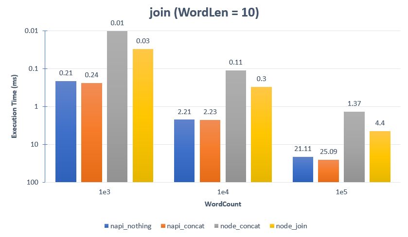
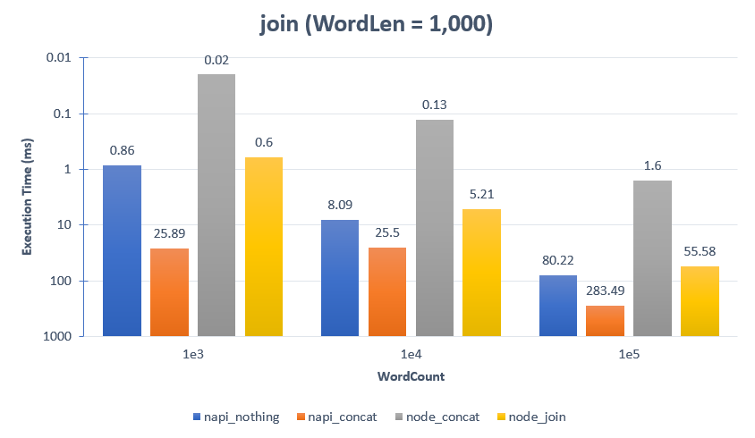
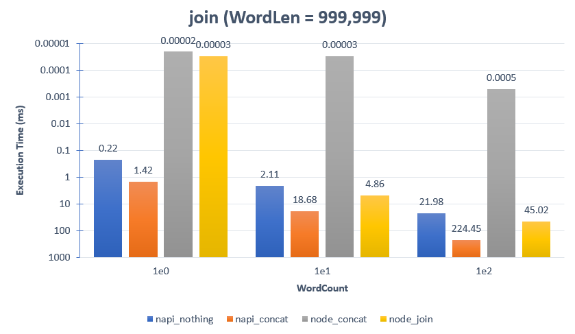

### How to build it?

**pre-build**

1. `npm install -g windows-build-tools` in admin mode.

**build**

1. `npm install`
2. `npm run build`
3. `npm run start`

---

### String Array Join


**Addon :**

```cpp
string joinByConcat(vector<string> arr){
    string joined;
    size_t arrlen = arr.size();
    for(size_t i=0; i<arrlen; i++){
        joined += arr[i];
    }
    return joined;
}
```

**Addon implemation :**

```cpp
Napi::String joinByConcat(const Napi::CallbackInfo& info)
{
    Napi::Env env = info.Env();

    //
    // Get first argument as Object.
    Napi::Object obj = info[0].As<Napi::Object>();

    //
    // Parse arguments from object.
    Napi::Array strarr = obj.Get("strarr").As<Napi::Array>();

    //
    // Append to string.
    std::string joined;
    uint32_t arrlen = strarr.Length();
    for (uint32_t i = 0; i < arrlen; i++) {
        std::string str = strarr.Get(i).As<Napi::String>().Utf8Value();
        joined += str;
    }

    //
    // Return as String.
    return Napi::String::New(env, joined);
}
```

**Comparative function :**

```cpp
Napi::String nothing(const Napi::CallbackInfo& info)
{
    ...

    //
    // Just read data, then nothing.
    std::string joined;
    uint32_t arrlen = strarr.Length();
    for (uint32_t i = 0; i < arrlen; i++) {
        std::string str = strarr.Get(i).As<Napi::String>().Utf8Value();
        // joined += str;
    }

    //
    // Return as String.
    return Napi::String::New(env, joined);
}
```

**Node using str += word :**

```ts
function joinByConcat(arr: string[]): string {
    let joined = "";
    for (let i = 0; i < arr.length; i++) {
        joined += arr[i];
    }
    return joined;
}
```

**Node using array.join() :**

```ts
function joinByJoin(arr: string[]): string {
    return arr.join();
}
```

---

### Benchmark

```ts
function createStringArray(wordCnt: number, wordLen: number): string[] {
    const strarr: string[] = [];
    for (let i = 0; i < wordCnt; i++) {
        const word: string = "-".repeat(wordLen);
        strarr.push(word);
    }
    return strarr;
}
```




