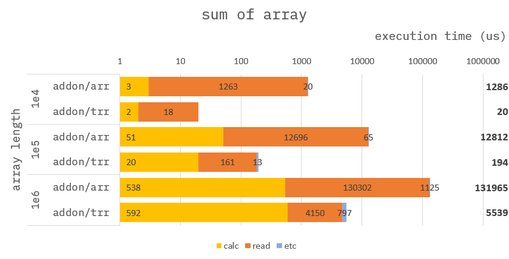
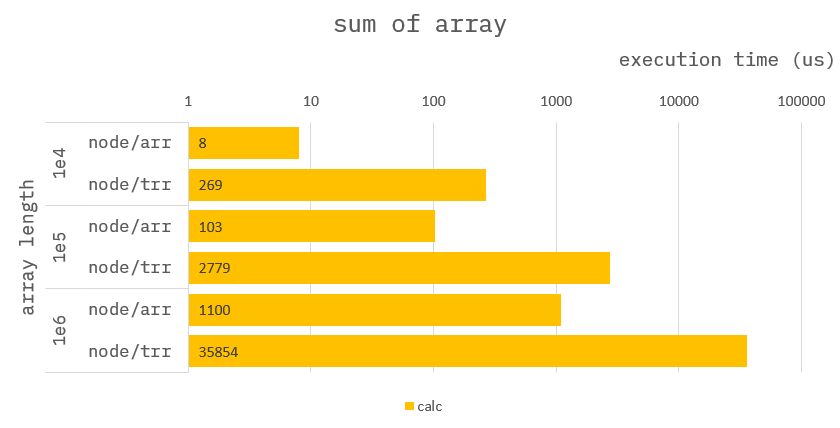

### How to build it?

**pre-build**

1. `npm install -g windows-build-tools` in admin mode.

**build**

1. `npm install`
2. `npm run build`
3. `npm run start`

---

### Sum of array (Improved using TypedArray)

**Addon :**

```cpp
Napi::Object getSumOfArray(const Napi::CallbackInfo& info)
{
    ...

    >>> auto numarr = obj.Get("numarr").As<Napi::TypedArrayOf<uint64_t>>();

    ...
}
```

**Node :**

```ts
function getSumOfArray({ numarr }) {
    //
    // Type of numarr === BigInt64Array
    let sum: number = 0;
    for (let i = 0; i < numarr.length; i++) {
        sum += Number(numarr[i]);
    }
    return {
        ans: sum,
        statics: {}
    };
}
```

---

### Benchmark - NAPI side

> Measure the average of 10,000 times.



The time to read data has been significantly reduced.

---

### Benchmark - NODE side

> Measure the average of 10,000 times.



Access to `BigInt64Array` and conversion to `number` causes overhead.
