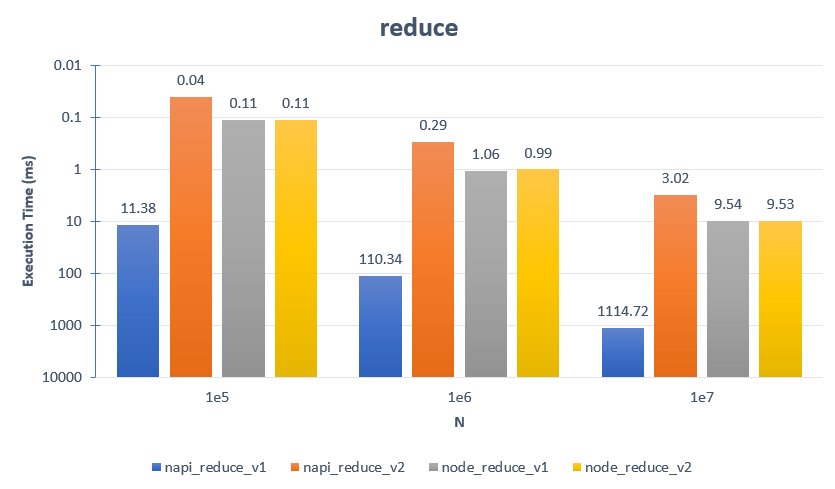

### How to build it?

**pre-build**

1. `npm install -g windows-build-tools` in admin mode.

**build**

1. `npm install`
2. `npm run build`
3. `npm run start`

---

### Number Array Reduce


**Addon :**

```cpp
int64_t reduce_v1(vector<int64_t> arr){
    int64_t sum = 0;
    size_t arrlen = arr.size();
    for(size_t i=0; i<arrlen; i++){
        sum += arr[i];
    }
    return sum;
}
```

```cpp
//
// if arr = [0, 1, 2, ..., N]
int64_t reduce_v2(int64_t N){
    int64_t sum = 0;
    for(size_t i=0; i<=N; i++){
        sum += arr[i];
    }
    return sum;
}
```

**Addon implemation :**

```cpp
Napi::Number reduce_v1(const Napi::CallbackInfo& info)
{
    Napi::Env env = info.Env();

    //
    // Get first argument as Object.
    Napi::Object obj = info[0].As<Napi::Object>();

    //
    // Parse arguments from object.
    Napi::Array numarr = obj.Get("numarr").As<Napi::Array>();

    int64_t sum = 0;
    uint32_t arrlen = numarr.Length();
    for (uint32_t i = 0; i < arrlen; i++) {
        int64_t num = numarr.Get(i).As<Napi::Number>().Int64Value();
        sum += num;
    }

    //
    // Return as Number.
    return Napi::Number::New(env, sum);
}
```

```cpp
Napi::Number reduce_v2(const Napi::CallbackInfo& info)
{
    Napi::Env env = info.Env();

    //
    // Get first argument as Object.
    Napi::Object obj = info[0].As<Napi::Object>();

    //
    // Parse arguments from object.
    int64_t N = obj.Get("n").As<Napi::Number>().Int64Value();

    int64_t sum = 0;
    for (uint32_t i = 0; i < N; i++) {
        sum += i;
    }

    //
    // Return as Number.
    return Napi::Number::New(env, sum);
}
```

**Node :**

```ts
function reduce_v1(arr: number[]): number {
    let sum = 0;
    for (let i = 0; i < arr.length; i++) {
        sum += arr[i];
    }
    return sum;
}
```

```ts
//
// if arr = [0, 1, 2, ..., N]
function reduce_v2(N: number): number {
    let sum = 0;
    for (let i = 0; i <= N; i++) {
        sum += arr[i];
    }
    return sum;
}
```

---

### Benchmark

The bigger the graph bar, the **better**.



##### concolusion :

Napi is faster than the node in operation, but there is an overhead in reading the data.
