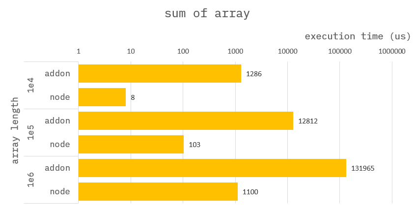
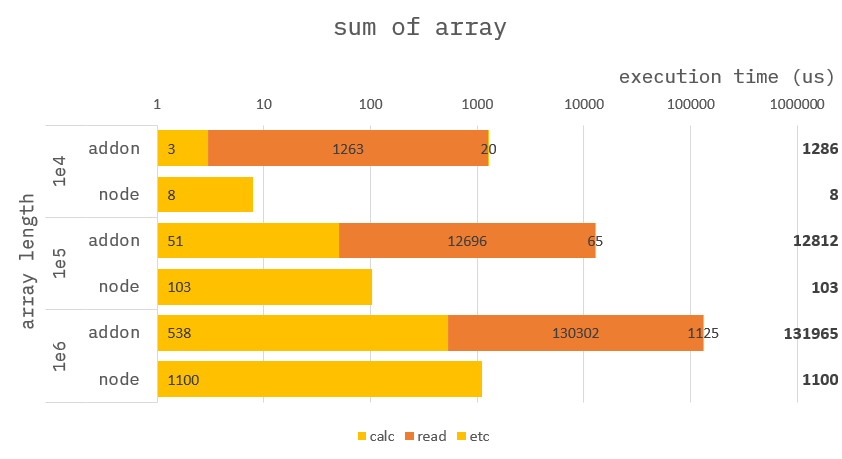

### How to build it?

**pre-build**

1. `npm install -g windows-build-tools` in admin mode.

**build**

1. `npm install`
2. `npm run build`
3. `npm run start`

---

### Sum of array


**Addon :**

```cpp
Napi::Object getSumOfArray(const Napi::CallbackInfo& info)
{
    std::vector<std::chrono::steady_clock::time_point> time;

    /* ------------------------------------
     *  Section : read data.
     * ------------------------------------ */
    time.push_back(std::chrono::high_resolution_clock::now());
    //
    // get argument.
    auto env = info.Env();
    auto obj = info[0].As<Napi::Object>();
    auto numarr = obj.Get("numarr").As<Napi::Array>();

    //
    // assign argument to vector.
    uint32_t arrlen = numarr.Length();
    std::vector<int64_t> vec;
    vec.reserve(arrlen);
    for (uint32_t i = 0; i < arrlen; i++) {
        int64_t num = numarr.Get(i).As<Napi::Number>().Int64Value();
        vec.push_back(num);
    }
    time.push_back(std::chrono::high_resolution_clock::now());

    /* ------------------------------------
     *  Section : calc sum of array.
     * ------------------------------------ */
    time.push_back(std::chrono::high_resolution_clock::now());
    uint64_t sum = 0;
    for (uint32_t i = 0; i < arrlen; i++) {
        sum += vec[i];
    }
    time.push_back(std::chrono::high_resolution_clock::now());

    //
    // Return ans.
    auto ans = Napi::Object::New(env);
    auto statics = Napi::Object::New(env);
    ans["ans"] = Napi::Number::New(env, sum);
    ans["statics"] = statics;
    statics["read data"] = std::chrono::duration_cast<std::chrono::nanoseconds>(time[1] - time[0]).count();
    statics["calc sum of array"] = std::chrono::duration_cast<std::chrono::nanoseconds>(time[3] - time[2]).count();
    return ans;
}
```

**Node :**

```ts
function getSumOfArray({ numarr }) {
    let sum = 0;
    for (let i = 0; i < numarr.length; i++) {
        sum += numarr[i];
    }
    return {
        ans: sum,
        statics: {}
    };
}
```

---

### Benchmark



The `NODE` seems slower than the `NAPI`, but in fact there is a trick.

---

### Benchmark-Detail



Computing the sum of an array is twice as fast as `NAPI` than `NODE`,
But you can see that it takes much more time to read and write data.
