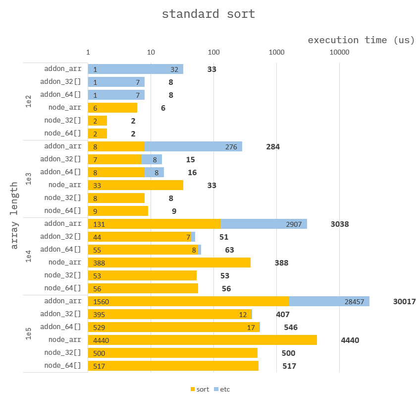

### How to build it?

**pre-build**

1. `npm install -g windows-build-tools` in admin mode.

**build**

1. `npm install`
2. `npm run build`
3. `npm run start`

---

### Standard sort

**Addon :**

```cpp
Napi::Object sort(const Napi::CallbackInfo& info)
{
    std::vector<std::chrono::steady_clock::time_point> time;

    //
    // get array.
    auto env = info.Env();
    auto obj = info[0].As<Napi::Object>();
    >>> auto numarr = obj.Get("numarr").As<Napi::TypedArrayOf<int32_t>>();
    auto data = numarr.Data();
    auto elemCnt = numarr.ElementLength();

    //
    // sort.
    time.push_back(std::chrono::high_resolution_clock::now());
    std::sort(data, data + elemCnt);
    time.push_back(std::chrono::high_resolution_clock::now());

    //
    // return ans.
    auto ans = Napi::Object::New(env);
    auto statics = Napi::Object::New(env);
    ans["ans"] = numarr;
    ans["statics"] = statics;
    statics["sort"] = std::chrono::duration_cast<std::chrono::nanoseconds>(time[1] - time[0]).count();
    return ans;
}
```

**Node :**

```ts
function sort({ numarr }) {
    return {
        ans: numarr.sort(),
        statics: {}
    };
}
```

---

### Benchmark

> Measure the average of 10,000 times.



By using `TypedArray`, get better performance.

On the `NAPI` side, Direct-DataView access makes performance even better.

You can see that the `NAPI-ETC`(= _read_ + _write_ + ...) entry has decreased significantly.
