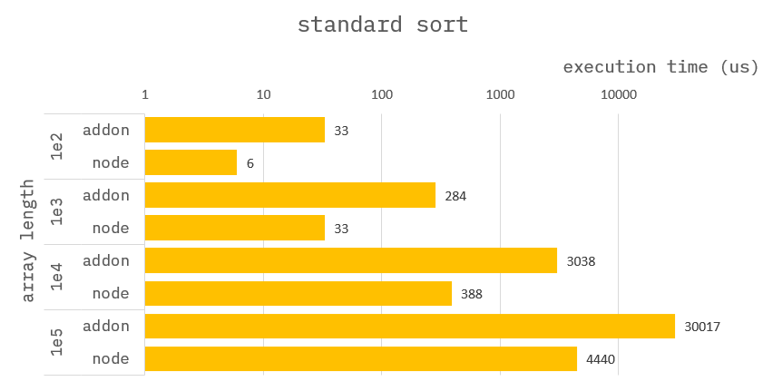
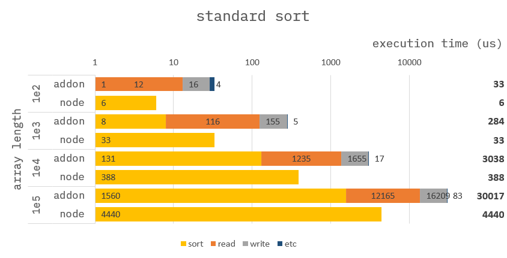

### How to build it?

**pre-build**

1. `npm install -g windows-build-tools` in admin mode.

**build**

1. `npm install`
2. `npm run build`
3. `npm run start`

---

### Standard sort


**Addon :**

```cpp
Napi::Object sort(const Napi::CallbackInfo& info)
{
    std::vector<std::chrono::steady_clock::time_point> time;

    /* ------------------------------------
     *  Section : read data.
     * ------------------------------------ */
    time.push_back(std::chrono::high_resolution_clock::now());
    //
    // get argument.
    auto env = info.Env();
    auto obj = info[0].As<Napi::Object>();
    auto numarr = obj.Get("numarr").As<Napi::Array>();

    //
    // assign argument to vector.
    uint32_t arrlen = numarr.Length();
    std::vector<int64_t> vec;
    vec.reserve(arrlen);
    for (uint32_t i = 0; i < arrlen; i++) {
        int64_t num = numarr.Get(i).As<Napi::Number>().Int64Value();
        vec.push_back(num);
    }
    time.push_back(std::chrono::high_resolution_clock::now());

    /* ------------------------------------
     *  Section : sort array.
     * ------------------------------------ */
    time.push_back(std::chrono::high_resolution_clock::now());
    std::sort(vec.begin(), vec.end());
    time.push_back(std::chrono::high_resolution_clock::now());

    /* ------------------------------------
     *  Section : write data.
     * ------------------------------------ */
    //
    // assign result to array.
    time.push_back(std::chrono::high_resolution_clock::now());
    for (uint32_t i = 0; i < arrlen; i++) {
        numarr[i] = vec[i];
    }
    time.push_back(std::chrono::high_resolution_clock::now());

    //
    // Return ans.
    auto ans = Napi::Object::New(env);
    auto statics = Napi::Object::New(env);
    ans["ans"] = numarr;
    ans["statics"] = statics;
    statics["read data"] = std::chrono::duration_cast<std::chrono::nanoseconds>(time[1] - time[0]).count();
    statics["sort array"] = std::chrono::duration_cast<std::chrono::nanoseconds>(time[3] - time[2]).count();
    statics["write result"] = std::chrono::duration_cast<std::chrono::nanoseconds>(time[5] - time[4]).count();
    return ans;
}
```

**Node :**

```ts
function sort({ numarr }) {
    return {
        ans: numarr.sort(),
        statics: {}
    };
}
```

---

### Benchmark

> Measure the average of 10,000 times.



Clearly, `NAPI` is slower than `NODE`.
But I don't think it's because `std::sort` is slower than `Array.prototype.sort`.

Let's take a closer look at why this happens.

---

### Benchmark-Detail

> Measure the average of 10,000 times.



Now everything is clear.

Although `std::sort` performs better, It takes a long time to handle with data in node format.
Except for the time to read and write data, you can see that `NAPI` is more faster.

But this is not a reason to use `NAPI-Sort`.
Because `Array.prototype.sort` is a better option.
