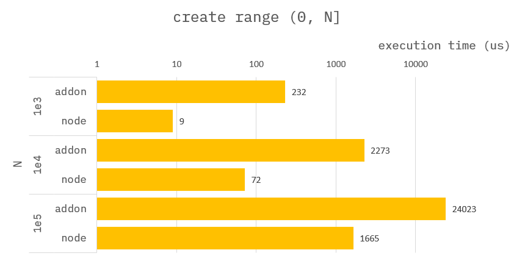
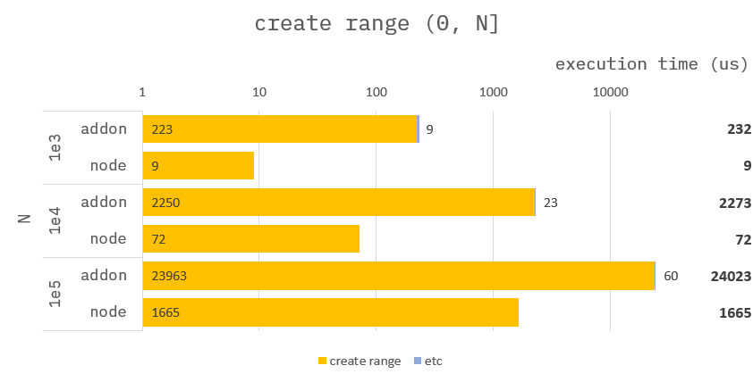

### How to build it?

**pre-build**

1. `npm install -g windows-build-tools` in admin mode.

**build**

1. `npm install`
2. `npm run build`
3. `npm run start`

---

### Create range [0, N)


**Addon :**

```cpp
Napi::Object createRange(const Napi::CallbackInfo& info)
{
    std::vector<std::chrono::steady_clock::time_point> time;

    //
    // get argument.
    auto env = info.Env();
    auto obj = info[0].As<Napi::Object>();
    auto end = obj.Get("end").ToNumber().Int64Value();

    //
    // create range
    time.push_back(std::chrono::high_resolution_clock::now());
    auto range = Napi::Array::New(env, end);
    for (uint32_t i = 0; i < end; i++) {
        range[i] = i;
    }
    time.push_back(std::chrono::high_resolution_clock::now());

    //
    // Return ans.
    auto ans = Napi::Object::New(env);
    auto statics = Napi::Object::New(env);
    ans["ans"] = range;
    ans["statics"] = statics;
    statics["create range"] = std::chrono::duration_cast<std::chrono::nanoseconds>(time[1] - time[0]).count();
    return ans;
}
```

**Node :**

```ts
function createRange({ end }) {
    const range: number[] = [];
    for (let i = 0; i < end; i++) {
        range.push(i);
    }
    return {
        ans: range,
        statics: {}
    };
}
```

---

### Benchmark

> Measure the average of 10,000 times.



---

### Benchmark-Detail

> Measure the average of 10,000 times.


