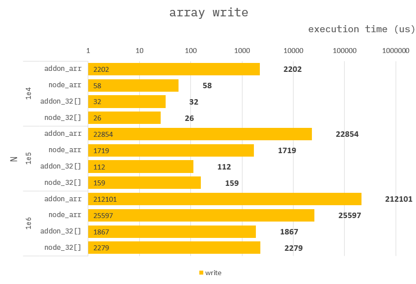

### How to build it?

**pre-build**

1. `npm install -g windows-build-tools` in admin mode.

**build**

1. `npm install`
2. `npm run build`
3. `npm run start`

---

### Write array

**Addon :**

```cpp
Napi::Object arrayWriteArr(const Napi::CallbackInfo& info)
{
    ...

    auto array = Napi::Array::New(env, end);
    for (int32_t i = 0; i < end; i++) {
        array[i] = i;
    }

    ...
}
```

```cpp
Napi::Object arrayWriteTrr(const Napi::CallbackInfo& info)
{
    ...

    auto array = Napi::TypedArrayOf<int32_t>::New(env, end);
    for (int32_t i = 0; i < end; i++) {
        array[i] = i;
    }

    ...
}
```

**Node :**

```ts
function arrayWriteArr({ end }) {
    const array: number[] = [];
    for (let i = 0; i < end; i++) {
        array[i] = i;
    }

    ...
}
```

```ts
function arrayWriteTrr({ end }) {
    const array = new Int32Array(end);
    for (let i = 0; i < end; i++) {
        array[i] = i;
    }

    ...
}
```

---

### Benchmark

> Measure the average of 10,000 times.



#### conclusion :

If you need to store small integers in **_bulk_**, you should use `TypedArray`.
