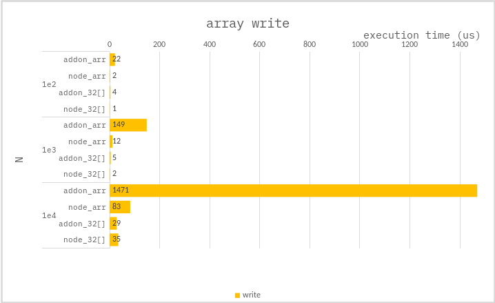

### Write array

**Addon :**

Array ver :

```cpp
auto array = Napi::Array::New(env, end);
for (int32_t i = 0; i < end; i++) {
    array[i] = i;
}
```

TypedArray ver :

```cpp
auto array = Napi::Int32Array::New(env, end);
for (int32_t i = 0; i < end; i++) {
    array[i] = i;
}
```

**Node :**

Array ver :

```ts
const array: number[] = [];
for (let i = 0; i < end; i++) {
    array[i] = i;
}
```

TypedArray ver :

```ts
const array = new Int32Array(end);
for (let i = 0; i < end; i++) {
    array[i] = i;
}
```

---

### Benchmark

> Measure the average of 10,000 times.



---

If you need to store small integers in **_bulk_**, you should use `TypedArray`.

Where `TypedArray` is one of:

-   Int8Array();
-   Uint8Array();
-   Uint8ClampedArray();
-   Int16Array();
-   Uint16Array();
-   Int32Array();
-   Uint32Array();
-   Float32Array();
-   Float64Array();
-   BigInt64Array();
-   BigUint64Array();
