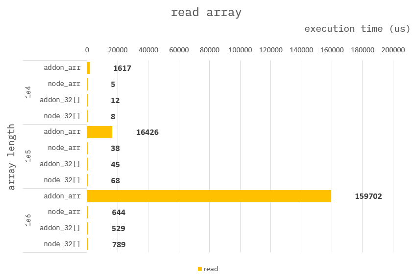

### How to build it?

**pre-build**

1. `npm install -g windows-build-tools` in admin mode.

**build**

1. `npm install`
2. `npm run build`
3. `npm run start`

---

### Read array

**Addon :**

```cpp
Napi::Object arrayReadArr(const Napi::CallbackInfo& info)
{
    ...

    auto arr = obj.Get("arr").As<Napi::Array>();
    auto len = arr.Length();
    int32_t num = 0;
    for (uint32_t i = 0; i < len; i++) {
        num = arr.Get(i).ToNumber().Int32Value();
    }

    ...
}
```

```cpp
Napi::Object arrayReadTrr(const Napi::CallbackInfo& info)
{
    ...

    auto trr = obj.Get("trr").As<Napi::TypedArrayOf<int32_t>>();
    auto len = trr.ElementLength();
    int32_t num = 0;
    for (int32_t i = 0; i < len; i++) {
        num = trr[i];
    }

    ...
}
```

**Node :**

```ts
function arrayReadArr({ arr }) {
    let num = 0;
    for (let i = 0; i < end; i++) {
        num = arr[i];
    }

    ...
}
```

```ts
function arrayReadTrr({ trr }) {
    let num = 0;
    for (let i = 0; i < end; i++) {
        num = trr[i];
    }

    ...
}
```

---

### Benchmark

> Measure the average of 10,000 times.



#### conclusion :

When passing an `array` to `NAPI`, you must pass it as a `TypedArray`.
