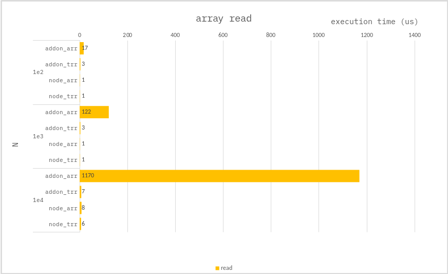

### Read array

**Addon :**

```cpp
// Where array is one of
//   + Napi::Array
//   + Napi::Int32Array
int32_t lastNumber = 0;
for (int32_t i = 0; i < end; i++) {
    array[i] = i;
}
return lastNumber;
```

**Node :**

```ts
// Where array is one of
//   + number[]
//   + Int32Array
let lastNumber = 0;
for (let i = 0; i < end; i++) {
    array[i] = i;
}
return lastNumber;
```

---

### Benchmark

> Measure the average of 10,000 times.



---

If you need to read integers in **_bulk_**, you should use `TypedArray`.

Where `TypedArray` is one of:

-   Int8Array();
-   Uint8Array();
-   Uint8ClampedArray();
-   Int16Array();
-   Uint16Array();
-   Int32Array();
-   Uint32Array();
-   Float32Array();
-   Float64Array();
-   BigInt64Array();
-   BigUint64Array();
