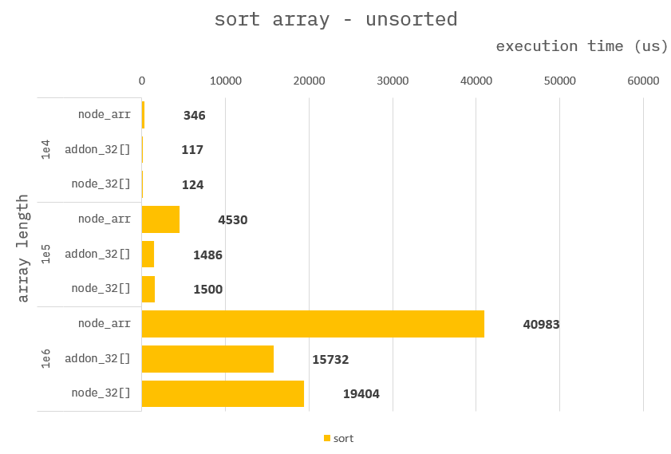
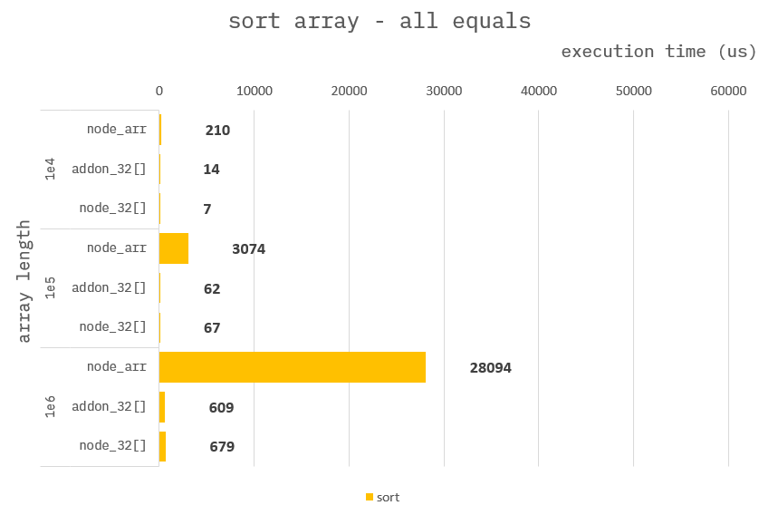

### How to build it?

**pre-build**

1. `npm install -g windows-build-tools` in admin mode.

**build**

1. `npm install`
2. `npm run build`
3. `npm run start`

---

### Standard sort

**Addon :**

```cpp
Napi::Object arraySortTrr(const Napi::CallbackInfo& info)
{
    ...

    auto trr = obj.Get("trr").As<Napi::TypedArrayOf<int32_t>>();
    auto dat = trr.Data();
    auto len = trr.ElementLength();

    //
    // use std::sort()
    std::sort(dat, dat + len);

    ...
}
```

**Node :**

```ts
function arraySortArr({ arr }) {
    //
    // use Array.prototype.sort()
    arr.sort();

    ...
}
```

```ts
function arraySortArr({ trr }) {
    //
    // use Int32Array.prototype.sort()
    trr.sort();

    ...
}
```

---

### Benchmark

> Measure the average of 10,000 times.

Measure performance for each array situation.

1. sorted
2. unsorted
3. all equals


---



---

