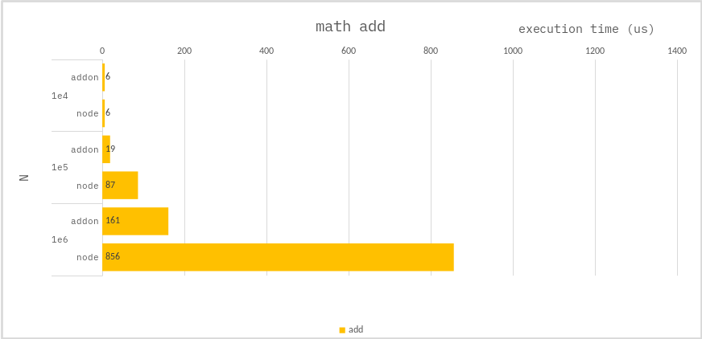

### Math add

```ts
let total = 0;
for (let i = 0; i < N; i++) {
    total += i;
}
```

### Benchmark

> Measure the average of 10,000 times.



---

For large add operations, `addon` are better for performance.
