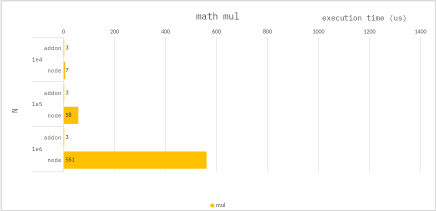

### Math mul

```ts
let lastSqure = 0;
for (let i = 0; i < N; i++) {
    lastSqure = i * i;
}
```

### Benchmark

> Measure the average of 10,000 times.



---

For large multiplication operations, `addon` are better for performance.
