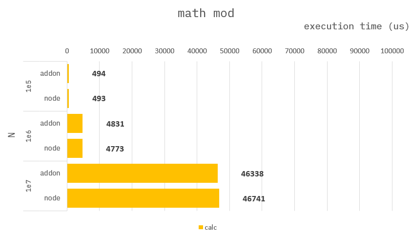

### How to build it?

**pre-build**

1. `npm install -g windows-build-tools` in admin mode.

**build**

1. `npm install`
2. `npm run build`
3. `npm run start`

---

### Math mul

**Addon :**

```cpp
Napi::Object mod(const Napi::CallbackInfo& info)
{
    ...

    int64_t lastMod = 0;
    for (int64_t i = 0; i < N; i++) {
        lastMod = i % i;
    }

    ...
}
```

**Node :**

```ts
function mod({ N }) {
    let lastMod = 0;
    for (let i = 0; i < N; i++) {
        lastMod = i % i;
    }

    ...
}
```

---

### Benchmark

> Measure the average of 10,000 times.


