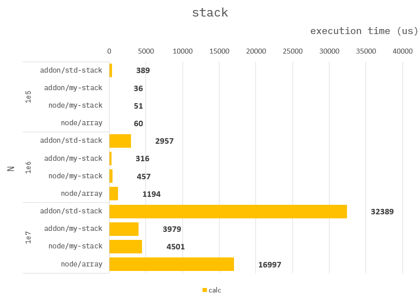

### How to build it?

**pre-build**

1. `npm install -g windows-build-tools` in admin mode.

**build**

1. `npm install`
2. `npm run build`
3. `npm run start`

---

### DataStructure Stack

Given an array of `positive integers` or `-1`.

Search from the beginning in order, putting a `positive integer` on the stack or subtracting one from the stack if `-1`.

At last returns the `top()` of the stack, or `undefined` if empty.

**Addon :**

```cpp
Napi::Object testStack1(const Napi::CallbackInfo& info)
{
    ...

    //
    // use std::stack
    std::stack<int32_t> s;

    ...
}
```

```cpp
Napi::Object testStack2(const Napi::CallbackInfo& info)
{
    ...

    //
    // use array-stack.
    int32_t *stack = new int32_t[len];
    int32_t cursor = 0;

    ...

    //
    // free array.
    delete stack;

    ...
}
```

**Node :**

```ts
function testStackArr({ input }) {
    //
    // use array.
    const stack :number[] = [];

    ...
}
```

```ts
function testStackTrr({ input }) {
    //
    // use typed-array stack.
    const stack = new Int32Array(input.length);
    let cursor = 0;

    ...
}
```

---

### Benchmark

> Measure the average of 10,000 times.


