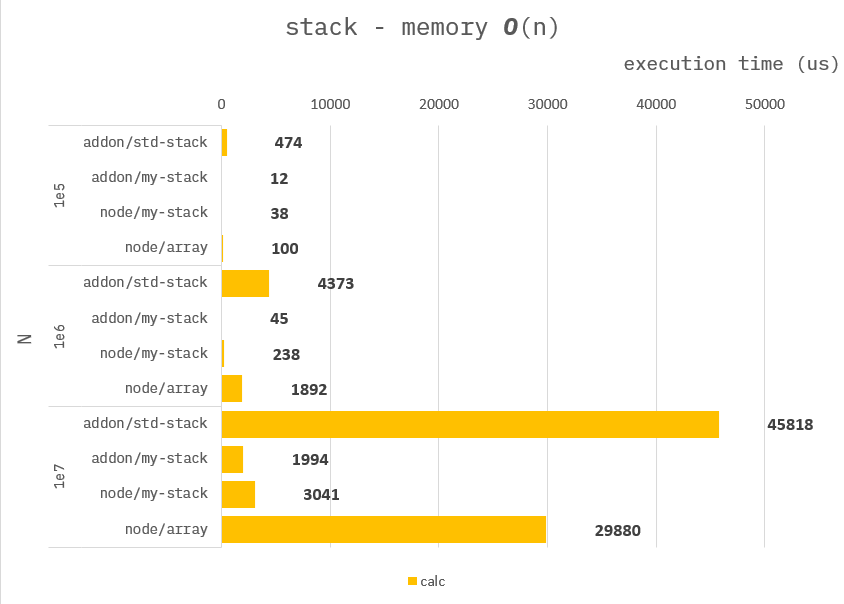
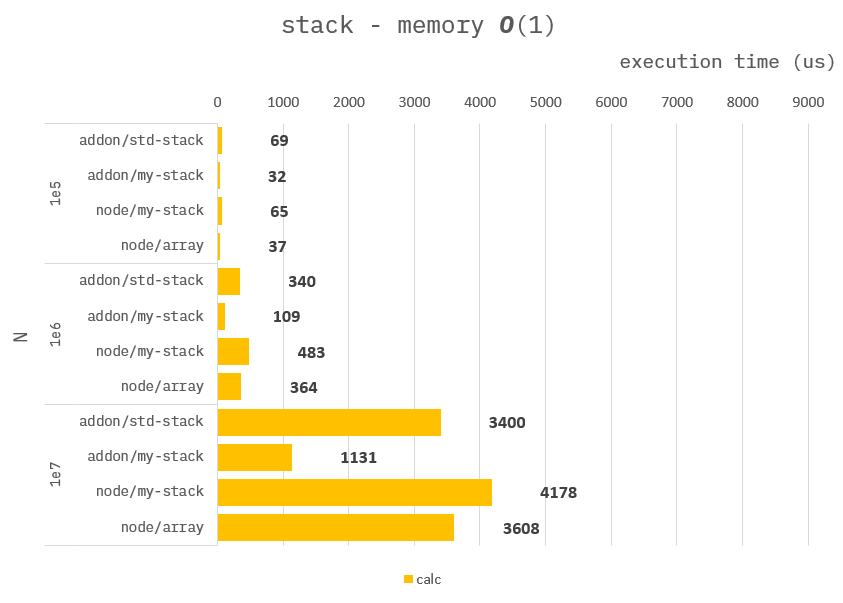

### How to build it?

**pre-build**

1. `npm install -g windows-build-tools` in admin mode.

**build**

1. `npm install`
2. `npm run build`
3. `npm run start`

---

### DataStructure Stack

**Addon :**

```cpp
Napi::Object testStack1(const Napi::CallbackInfo& info)
{
    ...

    //
    // use std::stack
    std::stack<int32_t> s;

    ...
}
```

```cpp
Napi::Object testStack2(const Napi::CallbackInfo& info)
{
    ...

    //
    // use array-stack.
    int32_t *stack = new int32_t[N];
    int32_t cursor = 0;

    ...

    //
    // free array.
    delete stack;

    ...
}
```

**Node :**

```ts
function testStackArr({ N }) {
    //
    // use array.
    const stack :number[] = [];

    ...
}
```

```ts
function testStackTrr({ N }) {
    //
    // use typed-array stack.
    const stack = new Int32Array(N);
    let cursor = 0;

    ...
}
```

---

### Benchmark - Memory O(n)

> Measure the average of 10,000 times.

```ts
//
// Memory complexity O(N)
for (let i = 0; i < N; i++) stack.push(i);
for (let i = 0; i < N; i++) stack.pop();
```



---

### Benchmark - Memory O(1)

> Measure the average of 10,000 times.

```ts
//
// Memory complexity O(1)
for (let i = 0; i < N; i++) {
    stack.push(i);
    stack.pop();
}
```



---

The above performance seems to be influenced by the following factors:

1. capacity expansion (especially `std::stack`)

2. performance of `push()` / `pop()` itself
