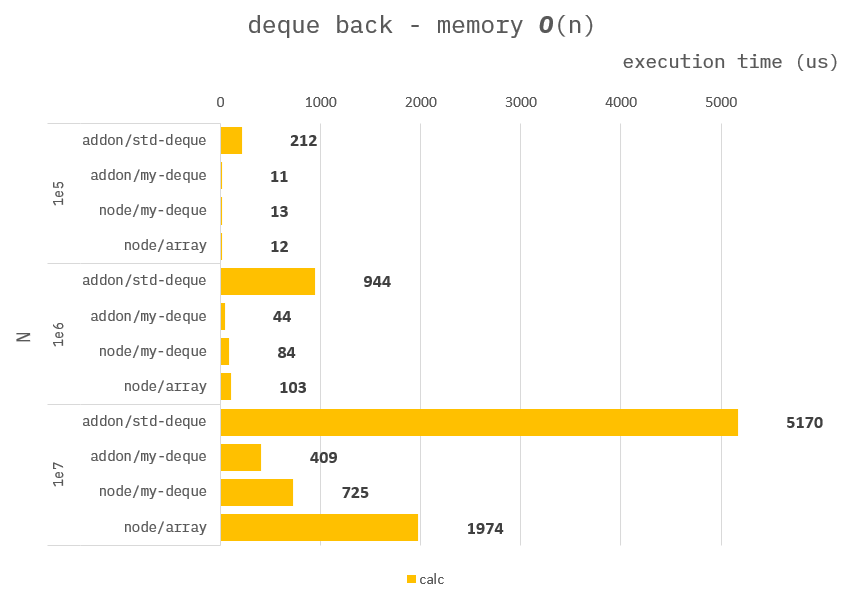
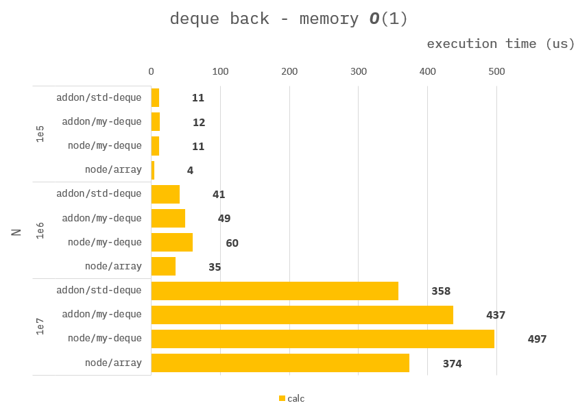
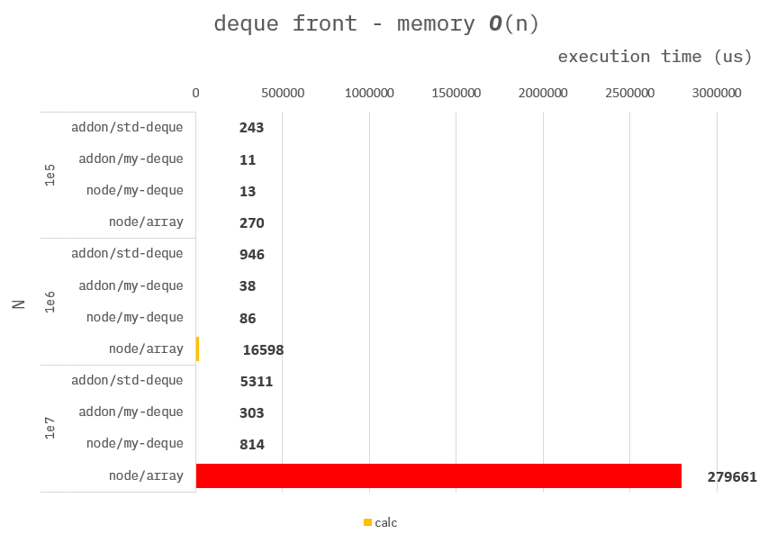

### How to build it?

**pre-build**

1. `npm install -g windows-build-tools` in admin mode.

**build**

1. `npm install`
2. `npm run build`
3. `npm run start`

---

### DataStructure Deque

**Addon :**

```cpp
Napi::Object testDeque1(const Napi::CallbackInfo& info)
{
    ...

    //
    // use std::deque
    std::deque<int32_t> s;

    ...
}
```

```cpp
Napi::Object testDeuqe2(const Napi::CallbackInfo& info)
{
    ...

    //
    // use fixed-array-deque.
    int32_t *data = new int32_t[N+1];
    int32_t front = 0;
    int32_t rare = 0;

    ...
}
```

**Node :**

```ts
function testDequeArr({ N }) {
    //
    // use array.
    const deque :number[] = [];

    ...
}
```

```ts
function testDequeTrr({ N }) {
    //
    // use typed-array deque.
    const data = new Int32Array(N);
    let front = 0;
    let rare = 0;

    ...
}
```

---

### Benchmark back - Memory O(n)

> Measure the average of 10,000 times.

```ts
//
// Memory complexity O(N)
for (let i = 0; i < N; i++) deque.push_back(i);
for (let i = 0; i < N; i++) deque.pop_back();
```



---

### Benchmark back - Memory O(1)

> Measure the average of 10,000 times.

```ts
//
// Memory complexity O(1)
for (let i = 0; i < N; i++) {
    deque.push_back(i);
    deque.pop_back();
}
```



---

### Benchmark front - Memory O(n)

> Measure the average of 10,000 times.

```ts
//
// Memory complexity O(N)
for (let i = 0; i < N; i++) deque.push_front(i);
for (let i = 0; i < N; i++) deque.pop_front();
```



---

### Benchmark front - Memory O(1)

> Measure the average of 10,000 times.

```ts
//
// Memory complexity O(1)
for (let i = 0; i < N; i++) {
    deque.push_front(i);
    deque.pop_front();
}
```


---

The above performance seems to be influenced by the following factors:

1. backward capacity expansion (especially `std::deque`)

2. forward capacity expansion (especially `Array.prototype.unshift()`)

3. performance of `push()` / `pop()` itself
