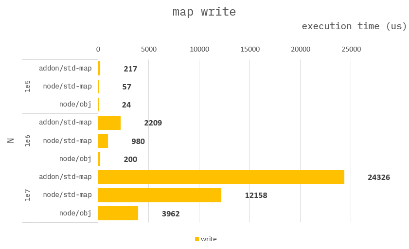
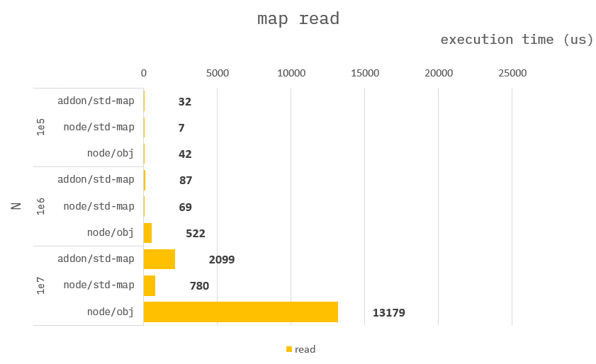
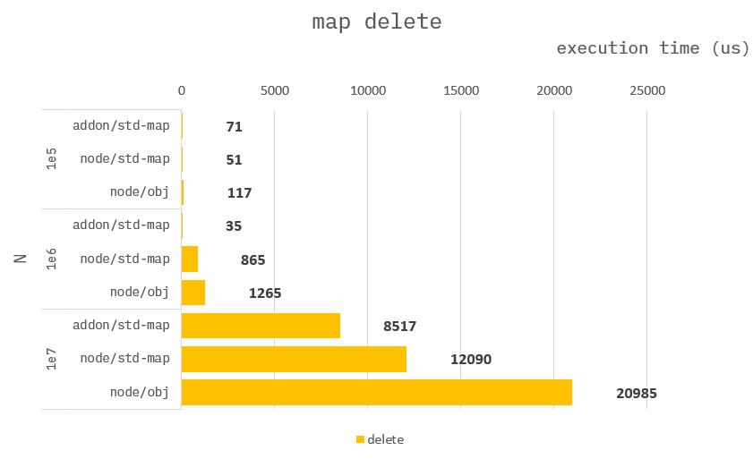

### How to build it?

**pre-build**

1. `npm install -g windows-build-tools` in admin mode.

**build**

1. `npm install`
2. `npm run build`
3. `npm run start`

---

### DataStructure Map

**Addon :**

```cpp
Napi::Object testMap(const Napi::CallbackInfo& info)
{
    ...

    //
    // use std::map
    std::map<int32_t, int32_t> m;

    ...
}
```

**Node :**

```ts
function testMap({ N }) {
    //
    // use standard map.
    const map = new Map<number, number>();

    ...
}
```

```ts
function testDequeTrr({ N }) {
    //
    // use object as map.
    const map : {[key:number]:number} = {};

    ...
}
```

---

### Benchmark back - Memory O(n)

> Measure the average of 10,000 times.

```ts
//
// Memory complexity O(N)
for (let i = 0; i < N; i++) deque.push_back(i);
for (let i = 0; i < N; i++) deque.pop_back();
```


---

### Benchmark write

> Measure the average of 10,000 times.

```ts
for (let i = 0; i < N; i++) {
    map[i] = i; // or map.set(i, i);
}
```



---

---

### Benchmark read

> Measure the average of 10,000 times.

```ts
let val;
for (let i = 0; i < N; i++) {
    val = map[i];
}
```



---

### Benchmark delete

> Measure the average of 10,000 times.

```ts
for (let i = 0; i < N; i++) {
    delete map[i]; // or map.delete(i);
}
```


