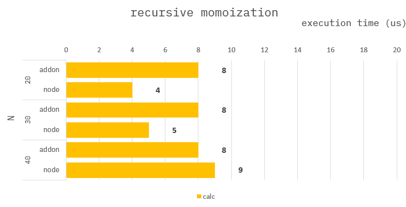

### How to build it?

**pre-build**

1. `npm install -g windows-build-tools` in admin mode.

**build**

1. `npm install`
2. `npm run build`
3. `npm run start`

---

### Algolithm Recursive fibo

**Common :**

```ts
const cache = new Map<number, number>();
//
// on c++
// int64_t* cache = new int64_t[N];
// delete cache;

function fibo(n: number): number {
    if (n === 1) return 0;
    if (n === 2) return 1;
    if (n === 3) return 1;

    const ans = fibo(n - 1) + fibo(n - 2);
    cache.set(n, ans);
    return ans;
}
```

---

### Benchmark

> Measure the average of 10,000 times.


