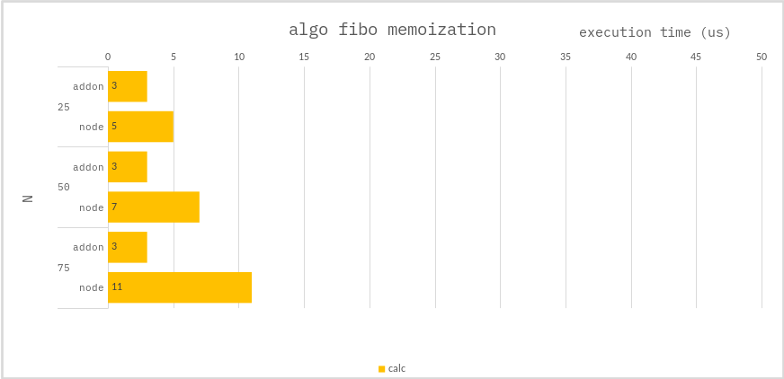

### Algo fibo recursive

```ts
const cache = new Map<number, number>();
function fibo(n: number): number {
    if (n === 0) return 0;
    if (n === 1) return 1;
    if (n === 2) return 1;
    if (!cache.has(n)) {
        cache.set(n, fibo(n - 1) + fibo(n - 2));
    }
    return cache.get(n);
}
```

### Benchmark

> Measure the average of 10,000 times.



---

The `addon` performs better, but it doesn't make much difference.
