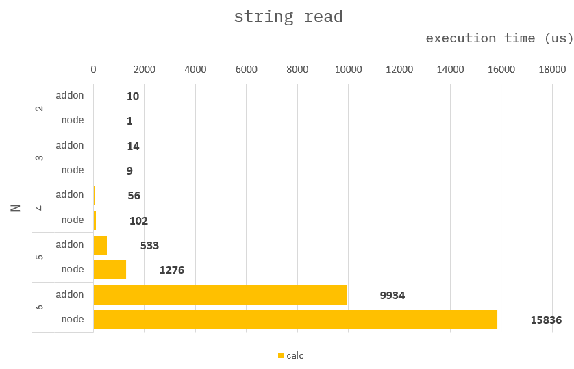

### How to build it?

**pre-build**

1. `npm install -g windows-build-tools` in admin mode.

**build**

1. `npm install`
2. `npm run build`
3. `npm run start`

---

### String read

**Common :**

```cpp
uint64_t stringRead(std::string str){
    uint64_t sum = 0;
    for(const char& ch : str){
        sum += ch;
    }
    return sum;
}
```

---

### Benchmark

> Measure the average of 10,000 times.


