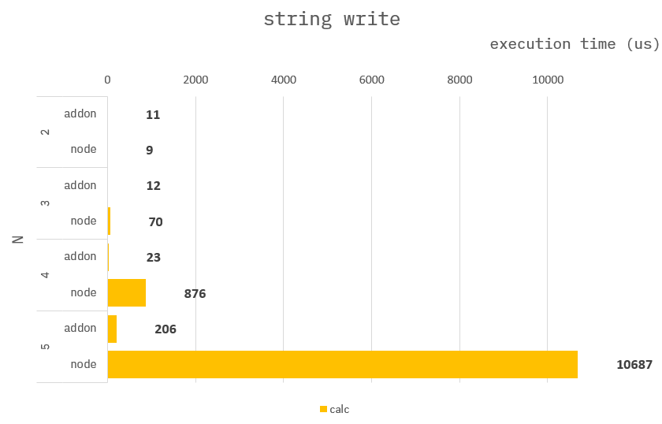

### How to build it?

**pre-build**

1. `npm install -g windows-build-tools` in admin mode.

**build**

1. `npm install`
2. `npm run build`
3. `npm run start`

---

### String write

**Common :**

```cpp
std::string stringRead(std::string str){
    for(char& ch : str){
        ch = (ch == '0' ? '1' : '0');
    }
    return str;
}
```

---

### Benchmark

> Measure the average of 10,000 times.


