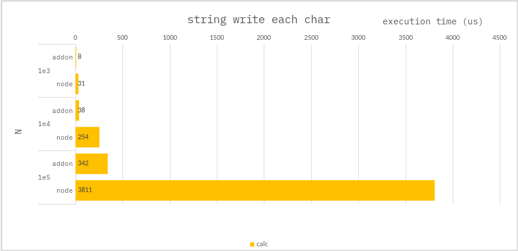

### String - write each char

Given a string of `zeros` or `only` ones, switch each character.

**example)**

-   11001 >> 00110

**c++ :**

```cpp
for(char &ch : str){
    ch = (ch == '0' ? '1' : '0');
}
```

**node :**

```ts
const arr = [];
const len = str.length;
for (let i = 0; i < len; i++) {
    //
    // In JavaScript, strings are immutable,
    // so you should create a new string for each character.
    const ch = str.charAt(i);
    arr.push(ch === "0" ? "1" : "0");
}

//
// Array.prototype.join() is most effective for combining strings.
str = arr.join();
```

### Benchmark

> Measure the average of 10,000 times.



---

### Conclusion

Because of the V8 engine string feature, `NODE` are **_not suitable_** for modifying strings.
