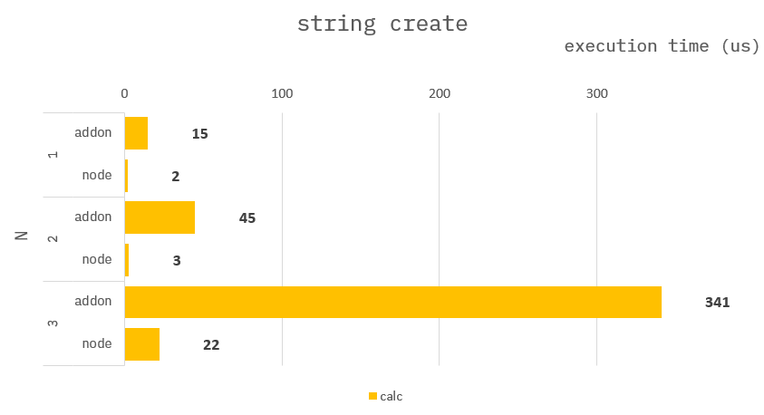

### How to build it?

**pre-build**

1. `npm install -g windows-build-tools` in admin mode.

**build**

1. `npm install`
2. `npm run build`
3. `npm run start`

---

### String write

**Common :**

```cpp
Napi::Object stringCreate(int32_t N){
    ...

    auto arr = Napi::Array::New(env)
    for(auto i=0; i<N; i++){
        arr[i] = std::to_string(i);
    }
}
```

---

### Benchmark

> Measure the average of 10,000 times.


