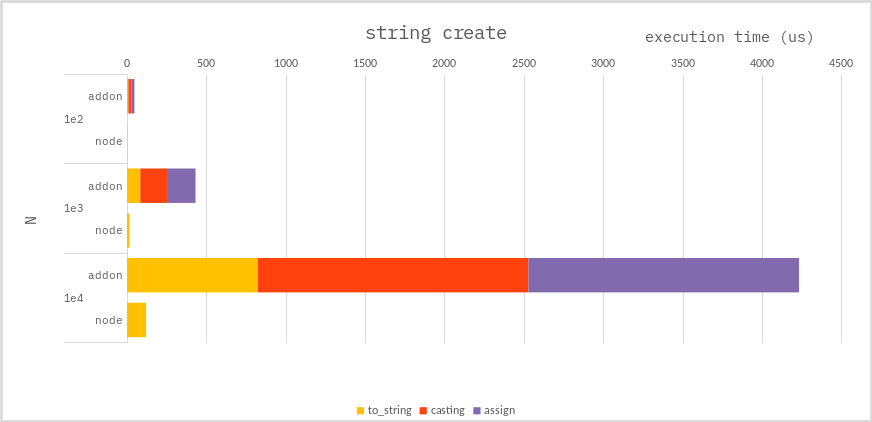

### String - create

**c++ :**

```cpp
auto arr = Napi::Array::New(env, N);
for(auto i=0; i<N; i++){
    //
    // below is the same as,
    //
    //     = Napi::String::New(env, std::to_string(i));
    arr[i] = std::to_string(i);
}
```

**node :**

```ts
let arr: string[] = [];
for (let i = 0; i < N; i++) {
    arr[i] = String(i);
}
```

### Benchmark

> Measure the average of 10,000 times.



---

### Conclusion

It looks like `NAPI` has three overheads:

-   `std::to_string()`
-   cast `std::string` to `Napi::String`
-   assign element to `Napi::Array`

Even if `to_string()` improves, the others is **_fatal_**.

Strings should be created in `NODE.JS`, whenever possible.
