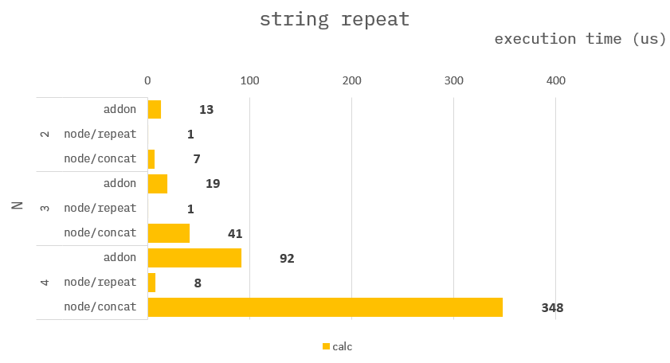

### How to build it?

**pre-build**

1. `npm install -g windows-build-tools` in admin mode.

**build**

1. `npm install`
2. `npm run build`
3. `npm run start`

---

### String Repeat

**C++ :**

```cpp
std::string stringRepeat(std::string str, int32_t N){
    std::string ret = "";
    for(auto i=0; i<N; i++){
        ret += str;
    }
}
```

**Node :**

```ts
// repeat
function (str:string, N:number) : string{
    return str.repeat(N);
}
```

```ts
// concat
function (str:string, N:number) : string{
    let ret:string = "";
    let arr:string[] = [];
    for(let i=0; i<N; i++) {
        arr.push(str);
    }
    return "".concat(...arr);
}
```

---

### Benchmark

> Measure the average of 10,000 times.


