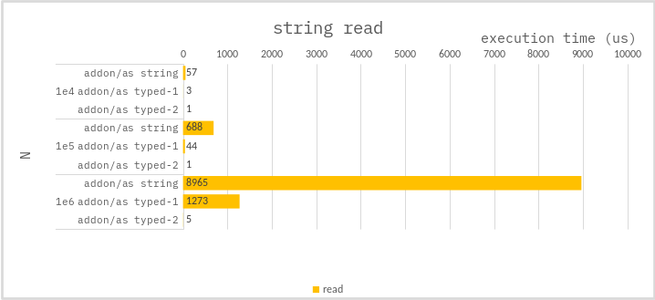

### String read

**Argument structure :**

```ts
const arg = {
    str : string;
    trr : Uint8Array; // Buffer of str.
}
```

**Addon :**

```cpp
//
// read as std::string
//
// label on benchmark :
//      addon/as string
std::string str = arg.str.ToString().Utf8Value();
```

```cpp
//
// read as char*
// then cast to std::string
//
// label on benchmark :
//      addon/as typed-1
char* c_str = (char*) arg.trr.As<Napi::Uint8Array>.Data();
std::string str = std::string(c_str);
```

```cpp
//
// read as char*
//
// label on benchmark :
//      addon/as typed-2
char* c_str = (char*) arg.trr.As<Napi::Uint8Array>.Data();
```

---

### Benchmark

> Measure the average of 10,000 times.

Only the time required for `casting to std::string or char*` was measured.


