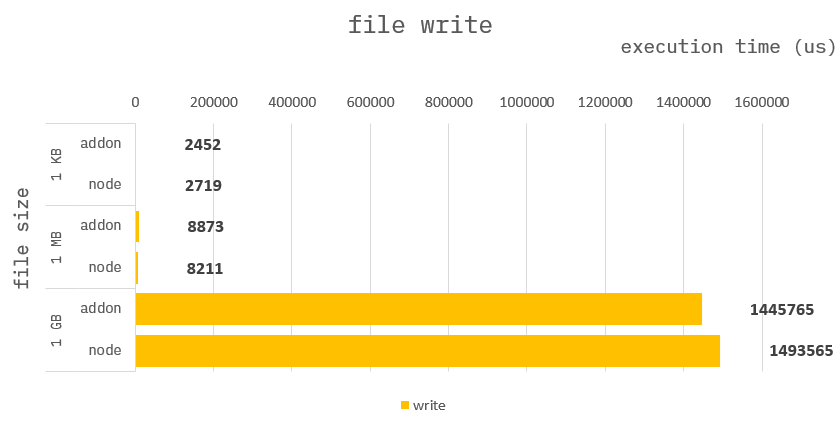

### How to build it?

**pre-build**

1. `npm install -g windows-build-tools` in admin mode.

**build**

1. `npm install`
2. `npm run build`
3. `npm run start`

---

### File write

**Addon :**

```cpp
auto dat = obj.Get("dat").As<Napi::Uint8Array>();
auto file = fopen("file_napi", "wb");
fwrite(dat.Data(), sizeof(uint8_t), dat.ByteLength(), file);
fclose(file);
```

**Node :**

```ts
function fileWrite({ dat }) {
    writeFileSync("file_node", dat);
}
```

---

### Benchmark

> Measure the average of 10,000 times. (But, for 1 GB only 50 times.)


