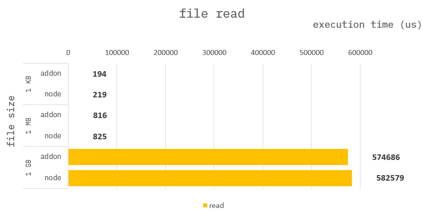

### How to build it?

**pre-build**

1. `npm install -g windows-build-tools` in admin mode.

**build**

1. `npm install`
2. `npm run build`
3. `npm run start`

---

### File read

**Addon :**

```cpp
auto file = fopen("file_napi", "rb");
auto buf = Napi::Uint8Array::New(env, N);
fread(buf.Data(), sizeof(uint8_t), N, file);
fclose(file);
```

**Node :**

```ts
function fileWrite({ dat }) {
    let data = readFileSync("file_node");
}
```

---

### Benchmark

> Measure the average of 100 times.


