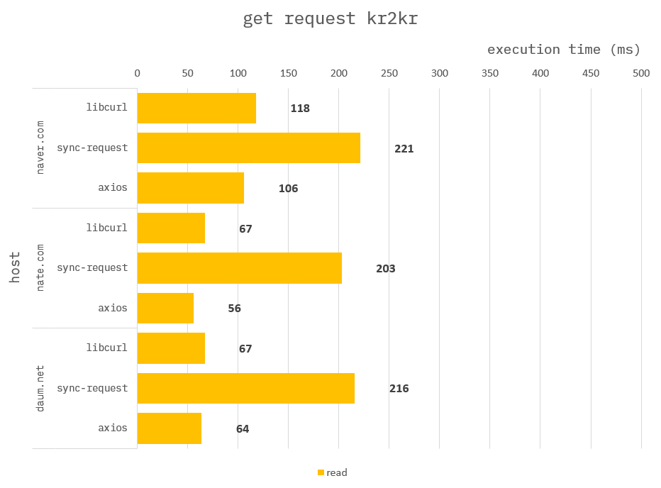
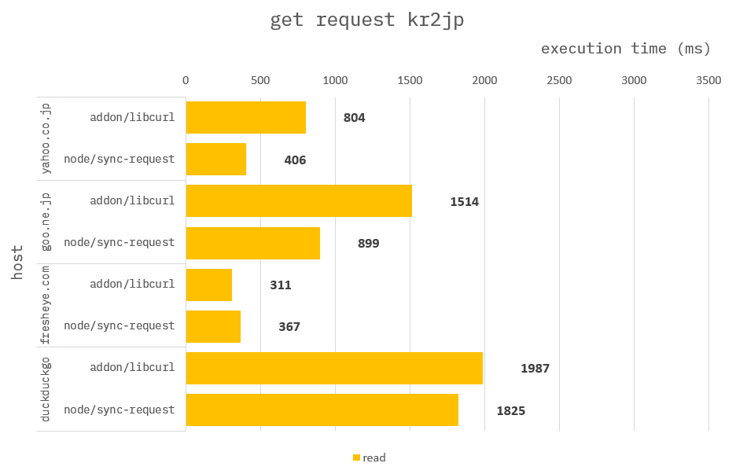
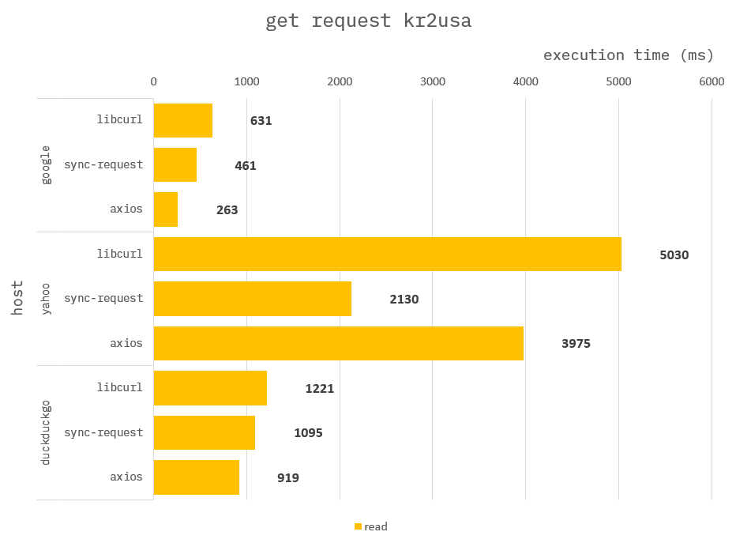

### How to build it?

**pre-build**

1. `npm install -g windows-build-tools` in admin mode.

**build**

1. `npm install`
2. `npm run build`
3. `npm run start`

---

### Http Get Request

**Addon :**

use `libcurl`.

**Node :**
use `sync-request`.

---

### Benchmark kr to kr

> Measure the average of 100 times.

### Benchmark kr to jp

> Measure the average of 100 times.

### Benchmark kr to usa

> Measure the average of 100 times.

---

Most domestic (Korean) sites have a better performance with `libcurl`.

For overseas sites, `sync-request` sometimes performs better.

Consider your own situation.
