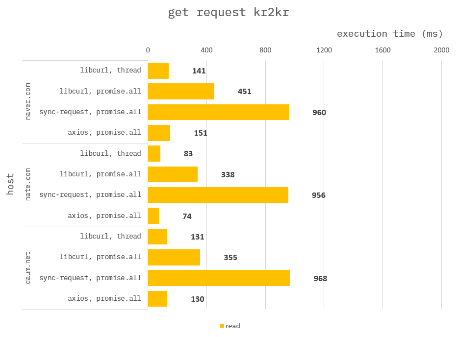
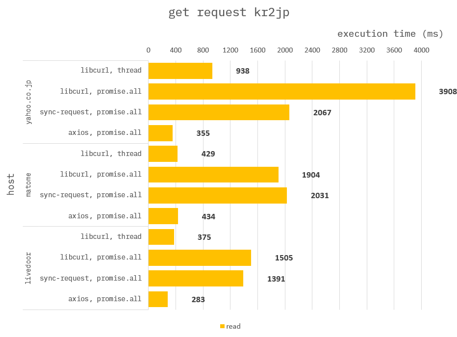
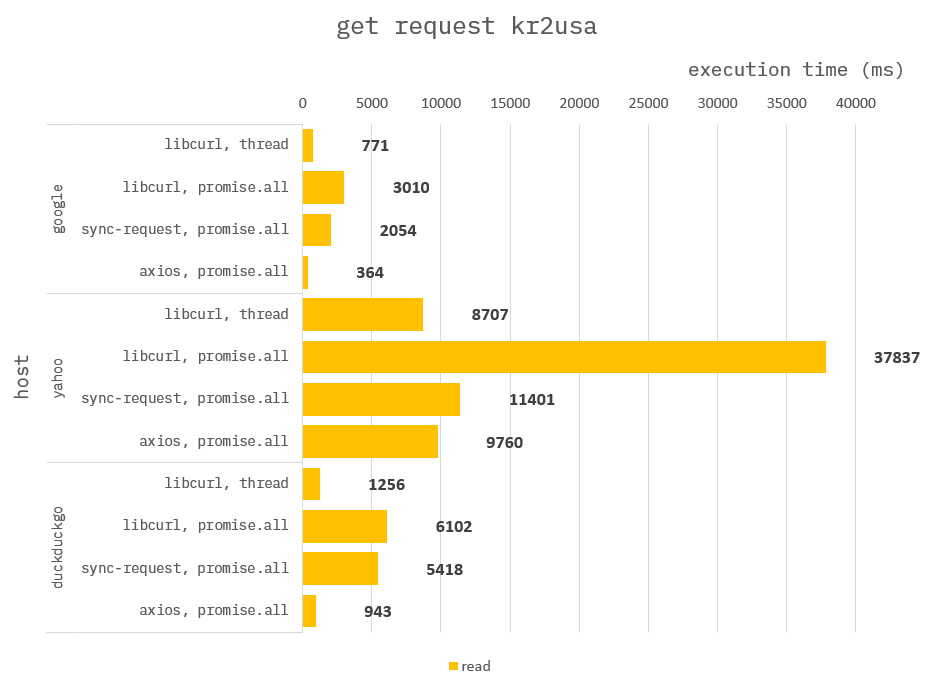
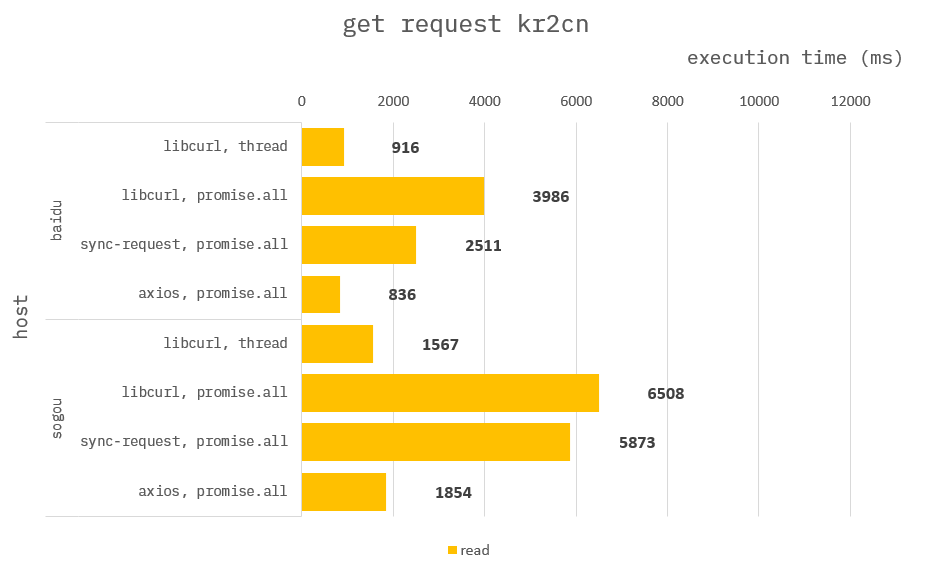

### How to build it?

**pre-build**

1. `npm install -g windows-build-tools` in admin mode.

**build**

1. `npm install`
2. `npm run build`
3. `npm run start`

---

### Http Get Request Parallel

Connect N connections simultaneously to a given site.

**Library :**

c++ :

1. `libcurl`

node :

1. `sync-request`
2. `axios`

**Implementation :**

1. c++ `libcurl` with `std::thread`
2. c++ `libcurl` with `Promise.all`
3. node `sync-request` with `Promise.all`
4. node `aixos` with `Promise.all`

---

### Benchmark kr to kr

> Measure the average of 3 times. (Number of concurrent connections: 5)

### Benchmark kr to jp

> Measure the average of 3 times. (Number of concurrent connections: 5)

### Benchmark kr to usa

> Measure the average of 3 times. (Number of concurrent connections: 5)

### Benchmark kr to cn

> Measure the average of 3 times. (Number of concurrent connections: 5)

