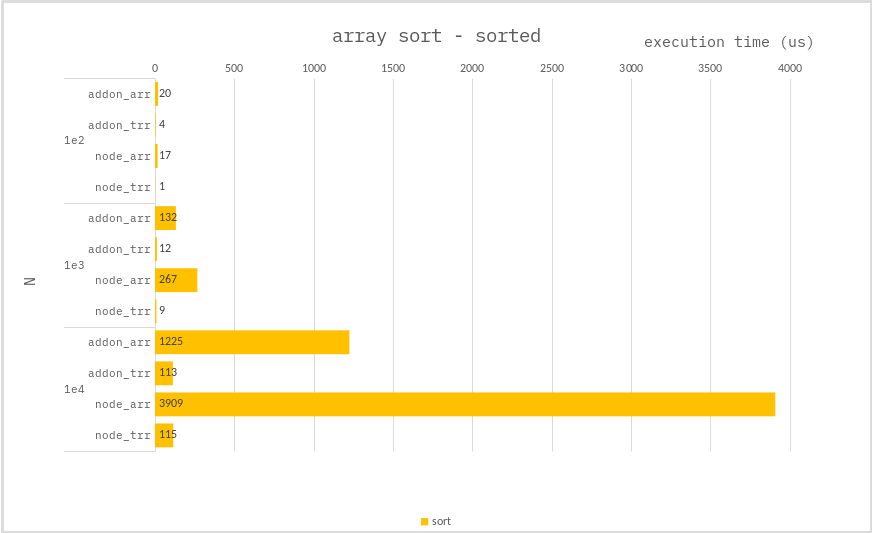
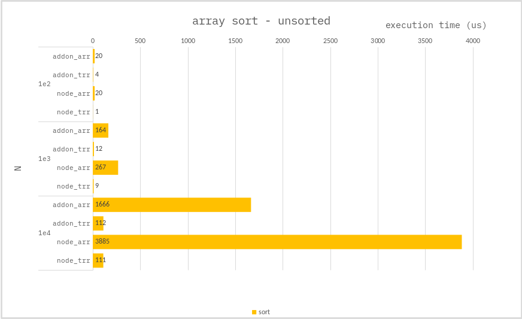
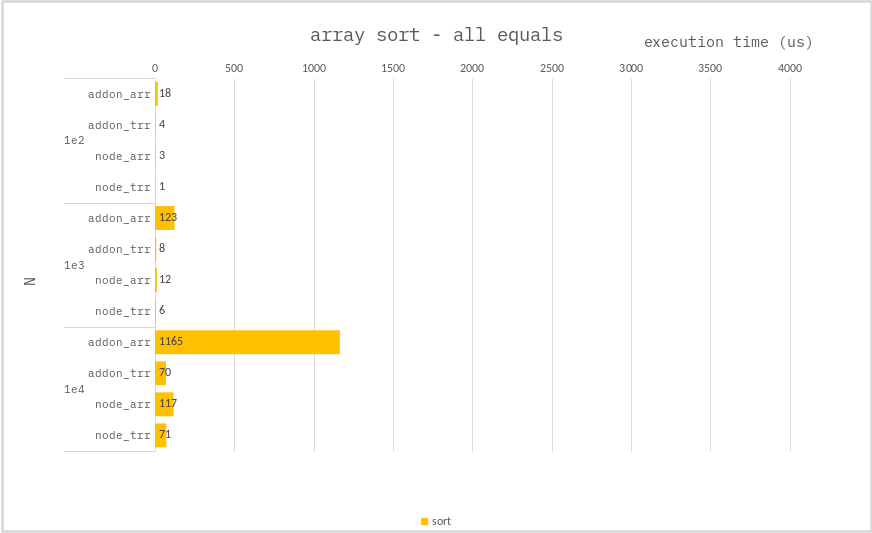

### Sort array

**Addon :**

use `std::sort`.

**Node :**

use `Array.prototype.sort` | `Int32Array.prototype.sort`.

---

### Benchmark

> Measure the average of 10,000 times.

Measure performance for each array situation.

1. sorted
2. unsorted
3. all equals

---

---

---

`TypedArray` has better sorting performance.

The difference between a sorted array and an array that is not is not large.

The more ratios with the same value, the better the performance.
