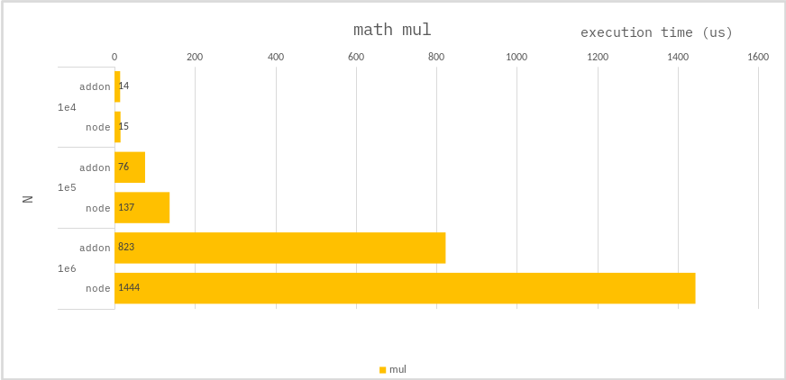

### Math mul

```ts
let typedArray = new Int32Array(N);
for (let i = 0; i < N; i++) {
    typedArray[i] = i * 1.5;
}
```

### Benchmark

> Measure the average of 10,000 times.



---

For large multiplication operations, `addon` are better for performance.
