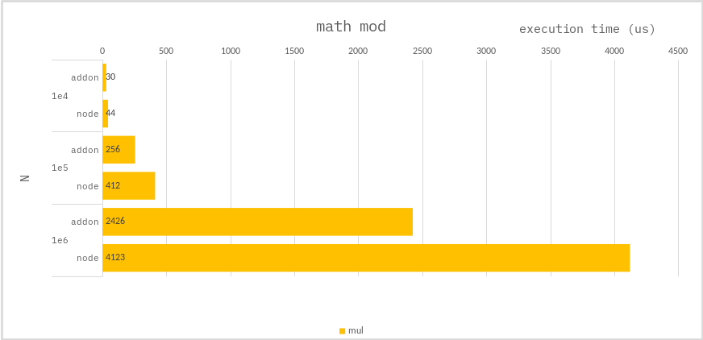

### Math mod

```ts
const trr = new Int32Array(N);
const ans = new Int32Array(N);
for (let i = 0; i < N; i++) {
    ans[i] = trr[i] % 7;
}
```

### Benchmark

> Measure the average of 10,000 times.



---

For large modulo operations, `addon` are better for performance.
