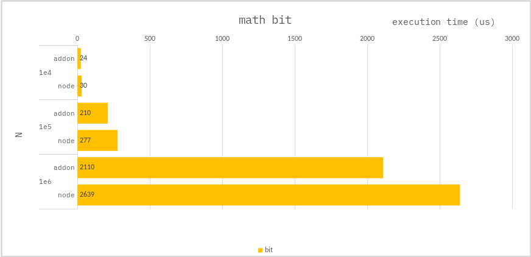

### Math bit

```ts
const trr = new Int32Array(N);
const ans = new Int32Array(N);
for (let i = 0; i < N; i++) {
    let v = i;
    v |= i;
    v &= i;
    v <<= 1;
    v = ~v;
    v >>= 1;
    ans[i] = v;
}
```

### Benchmark

> Measure the average of 10,000 times.



---

The `addon` performs better, but it doesn't make much difference.
