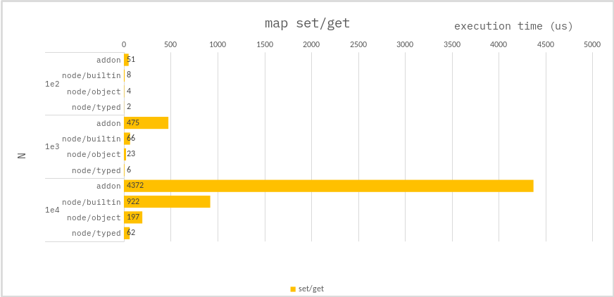

### Data Structure - Stack

**c++ :**

use `Napi::ObjectWrap`.

**node :**

use `Object` or `Map` or

```ts
class TypedMap {
    private dat : Int32Array;

    ...
}
```

### Benchmark

> Measure the average of 1,000 times.



---

### Conclusion

The reason why the addon map performed the worst was because of the cost of `NAPI call`.

`Object` performance isn't bad either, but if you can use `TypedArray`, you'll get better performance.

`Map` is convenient but heavy.
