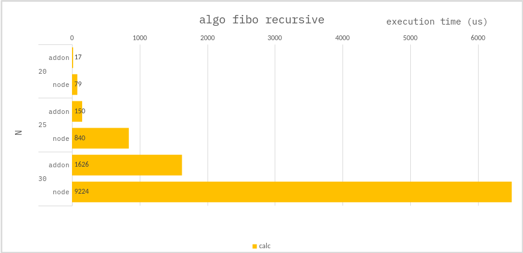

### Algo fibo recursive

```ts
function fibo(n: number): number {
    if (n === 1) return 0;
    if (n === 2) return 1;
    if (n === 3) return 1;
    return fibo(n - 1) + fibo(n - 2);
}
```

### Benchmark

> Measure the average of 100,000 times.



---

The `addon`'s performance is significantly better.
