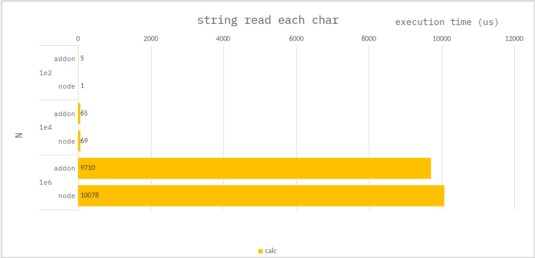

### String - read each char

**c++ :**

```cpp
size_t charSum = 0;
for(const char &ch : str){
    charSum += ch;
}
```

**node :**

```ts
const len = str.length;
let charSum = 0;
for (let i = 0; i < len; i++) {
    charSum += str.charCodeAt(i);
}
```

### Benchmark

> Measure the average of 10,000 times.



---

### Conclusion

If the string is **_short_**, performance of `NAPI` is worse than `NODE` because of the NAPI call cost.
