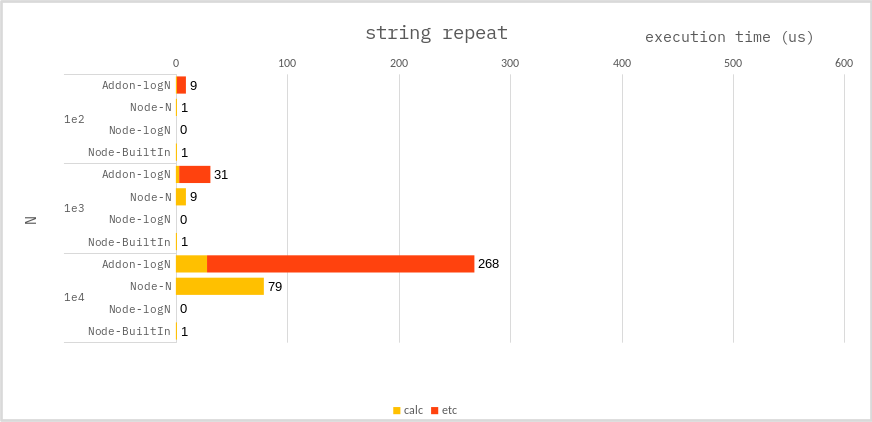

### String - repeat

**c++ :**

```cpp
//
// Time Complexity : O(log N);
std::string repeated = "";
while(N != 0){
    if(N & 1) {
        // repeated += str;
        // or
        repeated.append(str);
    }
    str += str;
    N >>= 1;
}
```

**node :**

```ts
//
// Time Complexity : O(N);
let repeated = "";
for (let i = 0; i < N; i++) {
    repeated += str;
}
```

```ts
//
// Time Complexity : O(log N);
let repeated = "";
while (N !== 0) {
    if (N & 1) {
        repeated += str;
    }
    str += str;
    N >>= 1;
}
```

### Benchmark

> Measure the average of 10,000 times.

Values ​​less than `0.5 us` are shown as `0 us`.



---

### Conclusion

It looks like `NAPI` has three overheads:

-   cost of `repeat()` function.
-   cost of `NAPI` calls.
-   cast `std::string` to `Napi::String`

However, it should be noted that the performance difference is large in algolihtm,
even though the `NAPI` and `NODE` implementations were **_not_** different.
Perhaps the `strings in node` work more efficiently.

Strings should be created in `NODE.JS`, whenever possible.
