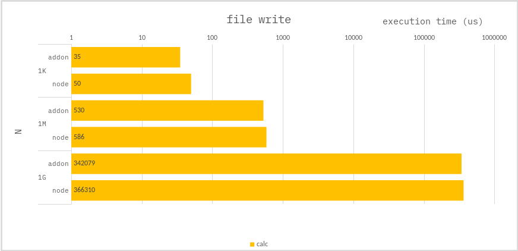

### File - write

Create a file of size `N bytes`, and then initialize it to `0 bytes`.

**c++ :**

use `fopen`, `freopen`, `fclose`

**node :**

use `fileWriteSync`

### Benchmark

> Measure the average of 1,000 times.

---

`NAPI` performs better, but it doesn't make much difference.
